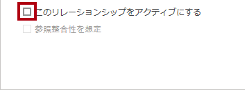
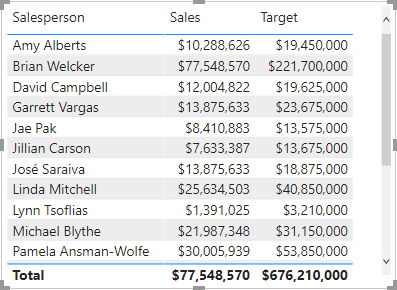
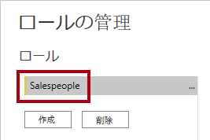
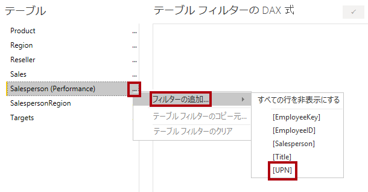
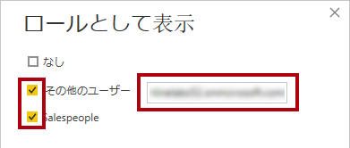
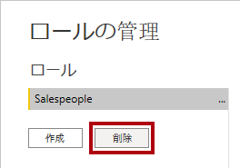



# **Power BI Desktop でのデータのモデル化、パート 2**

**このラボの推定所要時間: 45 分**

このラボでは **Salesperson** テーブルと **Sales** テーブルの間に多対多リレーションシップ を作成します。また、営業担当者が確実に自分の担当地域の売上データだけを分析できるように、行レベルのセキュリティも適用します。

このラボでは次の作業を行う方法について説明します。

- 多対多リレーションシップを構成する

- 行レベルのセキュリティを実行する

### **ラボ ストーリー**

このラボは、データの準備からレポートやダッシュボードとしての発行までの完全なストーリーとして設計された一連のラボのうちの 1 つです。ラボは任意の順序で完了できます。ただし、複数のラボを行う場合は、最初の 10 のラボを次の順序で行うことをお勧めします。

1. Power BI Desktop でのデータの準備

2. Power BI Desktop へのデータの読み込み

3. Power BI Desktop でのデータのモデル化、パート 1

4. **Power BI Desktop でのデータのモデル化、パート 2**

5. Power BI Desktop での DAX 計算の作成、パート 1

6. Power BI Desktop での DAX 計算の作成、パート 2

7. Power BI Desktop でのレポートの設計、パート 1

8. Power BI Desktop でのレポートの設計、パート 2

9. Power BI ダッシュボードの作成

10. Power BI Desktop におけるデータ分析の実施

11. Power BI でのページ分割されたレポートの作成

## **演習 1: 多対多のリレーションシップを作成する**

この演習では **Salesperson** テーブルと **Sales** テーブルの間に多対多リレーションシップ を作成します。

### **タスク 1: はじめに**

このタスクではこのラボ用の環境を設定します。

*重要: 前のラボから継続している (およびそのラボを完了している) 場合は、このタスクを完了しないで、次のタスクから続けてください。*

1. Power BI Desktop を開くには、タスク バーにある Microsoft Power BI Desktop のショートカットをクリックします。

	

2. 「はじめに」ウィンドウを閉じるには、ウィンドウの左上にある「**X**」をクリックします。

	

3. スターター Power BI Desktop ファイルを開くには、「**ファイル**」リボン タブをクリックして、バックステージ ビューを開きます。

4. 「**レポートを開く**」を選択します。

	

5. 「**レポートを参照**」をクリックします。

	

6. 「**開く**」ウィンドウで、**D:\DA100\Labs\configure-data-model-in-power-bi-desktop-advanced\Starter** フォルダーに移動します。

7. **Sales Analysis** ファイルを選択します。

8. 「**開く**」をクリックします。

	

9. 開いている情報ウィンドウをすべて閉じます。

10. ファイルのコピーを作成するには、「**ファイル**」リボン タブをクリックして、バックステージ ビューを開きます。

11. 「**名前を付けて保存**」を選択します。

	

12. 変更を適用するかどうかを確認するメッセージが表示されたら、「**適用**」をクリックします。

	

13. 「**名前を付けて保存**」ウィンドウで、**D:\DA100\MySolution** フォルダーに移動します。

14. 「**保存**」をクリックします。

	

### **タスク 2: 多対多リレーションシップを作成する**

このタスクでは **Salesperson** テーブルと **Sales** テーブルの間に多対多リレーションシップを作成します。

1. Power BI Desktop のレポート ビューの「**フィールド**」ウィンドウで、次の 2 つのフィールドを確認してテーブル ビジュアルを作成します。

	- Salesperson | Salesperson

	- Sales | Sales

	*ラボでは、フィールドを参照するために省略表記を使用します。次のようになります。**Salesperson | Salesperson**。この例では、**Salesperson** はテーブル名、**Salesperson** はフィールド名です。*

	

	*テーブルには、各営業担当者の売上が表示されます。しかし、営業担当者と営業の間には別のリレーションシップもあります。営業担当者により、担当する地域の数は 1 つ、2 つ、またはそれより多い可能性もあります。また、販売地域には複数の営業担当者を割り当てることができます。*

	*業績管理の観点からは、営業担当者の売上を (割り当てられた担当地域に基づいて) 分析し、販売目標と比較する必要があります。次の演習では、この分析をサポートするリレーションシップを作成します。*

2. Michael Blythe は約 900 万ドルを売り上げていることに注目してください。

3. モデル ビューに切り替えます。

	

4. **SalespersonRegion** テーブルをドラッグして、**Region** と **Salesperson** テーブルの間に配置します。

5. ドラッグ アンド ドロップ手法を使用して、次の 2 つのモデル リレーションシップを作成します。

	- **Salesperson | EmployeeKey** から **SalespersonRegion | EmployeeKey**

	- **Region | SalesTerritoryKey** から **SalespersonRegion | SalesTerritoryKey**

	***SalespersonRegion** テーブルは、ブリッジ テーブルと見なすことができます。*

6. レポート ビューに切り替えて、ビジュアルが更新されていない (Michael Blythe の売上結果が変更されていない) ことを確認します。

7. モデル ビューに戻り、**Salesperson** テーブルのリレーションシップ フィルターの方向 (矢印) に従います。

	***Salesperson** テーブルが **Sales** テーブルにフィルターを適用すると考えてください。また、**SalespersonRegion** テーブルにフィルターが適用されますが、**Region** テーブルには引き続き反映されていません (矢印が間違った方向を指しています)。*

	

8. **Region** テーブルと **SalespersonRegion** テーブルの間のリレーションシップを編集するには、リレーションシップをダブルクリックします。

9. 「**リレーションシップの編集**」ウィンドウの **クロス フィルターの方向**」ドロップダウン リストで、「**両方**」を選択します。

10. 「**両方向にセキュリティ フィルターを適用する**」チェックボックスをオンにします。

	*この設定により、行レベルのセキュリティが適用されるときに双方向のフィルター処理が適用されます。次の演習では、セキュリティ ロールを構成します。*

	

11. 「**OK**」をクリックします。

	

12. リレーションシップの矢印の向きが両方になっていることにご注意ください。

	

13. レポート ビューに切り替えると、販売の値が依然として変更されていないことがわかります。

	*この問題は、**Salesperson** テーブルと **Sales** テーブルの間にフィルターを反映させるパスが 2 つあるという事実に関連しています。このあいまいさは、「テーブルの数が最も少ない」という評価観点に基づいて内部的に解決されます。明確にするために、このようなあいまいさを持つモデルを設計しないでください。この問題は、このラボの後半で部分的に解決され、**Power BI Desktop での DAX 計算の作成、パート 1** のラボを完了するまでに解決されます。*

14. モデル ビューに切り替えます。

15. ブリッジ テーブルを介してフィルターの伝達を強制するには、**Salesperson** テーブルと **Sales** テーブルのリレーションシップを編集 (ダブルクリック) します。

16. 「**リレーションシップの編集**」ウィンドウで、「**このリレーションシップをアクティブにする**」チェックボックスをオフにします。

	

17. 「**OK**」をクリックします。

	

	*フィルターの伝達が、アクティブなパスのみに従うようになりました。*

18. 図で、非アクティブなリレーションシップは破線で表されていることにご注意ください。

	

19. レポートビューに切り替えると、Michael Blythe の売り上げが 2,200 万ドル近くになっていることが分かるでしょう。

	

20. また、各営業担当者の売上がテーブル合計を上回る場合もあります。

	*地域別の販売実績を二重、三重などにカウントするため、多対多のリレーションシップが一般的に観察されます。2 番目の営業担当者である Brian Welcker について考えてみましょう。彼の売上金額は合計売上金額と同じです。Brian Welcker は営業担当部長であるため、これは正しい結果です。Brian Welcker の売上は全地域の売上で測定されます。*

	*多対多リレーションシップは現在機能していますが、営業担当者による販売を分析することはできません (リレーションシップは非アクティブであるため)。**Power BI Desktop での DAX 計算の作成、パート 1** ラボで (彼らの地域の) パフォーマンス分析のために営業担当者を表す計算テーブルを導入すると、リレーションシップを再有効化できます。*

21. モデリング ビューに切り替え、ダイアグラム上で **Salesperson** テーブルを選択します。

22. 「**プロパティ**」ウィンドウの「**名前**」ボックスで 、テキストを **Salesperson (Performance)** に置き換えます。

	*名前を変更したテーブルには、その目的が反映されます。つまり、このテーブルを使用して、営業担当者が割り当てられた販売地域の売上に基づいて営業担当者の業績をレポートおよび分析します。*

### **タスク 3: Targets テーブルを関連付ける**

このタスクでは **Targets** テーブルにリレーションシップを作成します。

1. **Salesperson (Performance)** からリレーションシップを作成する **| EmployeeID** 列と **Targets | EmployeeID** 列。

2. レポート ビューで、テーブル ビジュアルに **Targets | Target** フィールドを追加します。

3. テーブル ビジュアルのサイズを変更し、すべての列が表示されるようにします。

	

	*売上と目標を視覚化することが可能になりましたが、2 つの点において注意が必要です。第 1 に、期間に対するフィルターがないため、目標には将来の目標金額も含まれます。第 2 に、目標は加算できないため、合計が表示されないようにする必要があります。これらは、ビジュアルの書式設定を使用して無効にするか、計算ロジックを使用して削除できます。**Power BI Desktop での DAX 計算の作成、パート 2** ラボでは、目標メジャーを作成する 2 つ目のアプローチに従い、複数の営業担当者がフィルタリングされた場合に BLANK を返すようにします。*

## **演習 2: 行レベルのセキュリティを実行する**

この演習では、営業担当者が割り当てられた地域での売上のみを表示できるように、行レベルのセキュリティを適用します。

### **タスク 1: 行レベルのセキュリティを実行する**

このタスクでは、行レベルのセキュリティを適用して、営業担当者が割り当てられた地域での売上のみを表示できるようにします。

1. データ ビューに切り替えます。

	

2. **フィールド** ウィンドウで、**Salesperson (Performance)** テーブルを選択します。

3. データを確認し、Michael Blythe (EmployeeKey 281) の UPN 値が **michael-blythe@adventureworks.com** であることを確認します。

	*Michael Blythe は 3 つの販売地域である米国北東部、米国中部、米国南東部に割り当てられていることを思い出してください。*

4. レポート ビューに切り替えます。

5. 「**モデリング**」リボン タブの「**セキュリティ**」グループの内から、「**ロールの管理**」をクリック します。

	

6. 「**ロールの管理**」ウィンドウで、「**作成**」をクリックします。

	

7. ボックスで、選択したテキストをロールの名前に置き換えます。「**Salespeople** をクリックし **Enter** キーを押します。

	

8. フィルターを割り当てるには、**Salesperson (Performance)** テーブルの省略記号 (..) 文字をクリックし、**「フィルターの追加」 | [UPN]** を選択します。

	

9. 「**テーブル フィルター DAX 式**」ボックスで、**"Value"** を **USERPRINCIPALNAME()** に置き換えて式を変更します。

	

	*USERPRINCIPALNAME() は、認証されたユーザーの名前を返す Data Analysis Expressions (DAX) 関数です。つまり、**Salesperson (Performance)** テーブルは、モデルに対してクエリを実行するユーザーのユーザー プリンシパル名 (UPN) でフィルター処理されます。*

10. 「**保存**」をクリックします。

	

11. セキュリティ ロールをテストするには、「**モデリング**」リボン タブの「**セキュリティ**」グループ内から、「**表示方法**」をクリックします。

	

12. 「**ロールとして表示**」ウィンドウで、「**その他のユーザー**」項目をオンにし、対応するボックスに「**michael-blythe@adventureworks.com**」と入力します。

13. **営業担当者** ロールを確認します。

	

	*この構成では **営業担当者** ロールが使用され、Michael Blythe の名前を使用してなりすまします。*

14. 「**OK**」をクリックします。

	

15. レポート ページの上に黄色のバナーが表示され、テスト セキュリティ コンテキストが説明されています。

	

16. テーブル ビジュアルでは、営業担当者の **Michael Blythe** のみがリストされていることに注目してください。

	

17. テストを中止するには、黄色のバナーの右側にある **表示を中止** をクリックします。

	

	*Power BI Desktop ファイルが Power BI サービスに発行されると、セキュリティ プリンシパルを **営業担当者** ロールにマップする発行後のタスクを完了する必要があります。これはこのラボでは行いません。*

18. ロールを削除するには、「**モデリング**」リボン タブの「**セキュリティ**」グループ内から、「**ロールの管理**」をクリックします。

	*ラボでは行レベルのセキュリティについてこれ以上の作業は行いません。*

	

19. 「**ロールの管理**」ウィンドウで、「**削除**」をクリックします。

	

20. 削除の確認を求められたら、「**はい、削除します**」をクリックします。

21. 「**保存**」をクリックします。

	

### **タスク 2: 仕上げ**

このタスクではラボを完了します。

1. Power BI Desktop ファイルを保存します。

2. クエリを適用するかどうかを確認するメッセージが表示されたら、「**後で適用**」をクリックします。

3. 次のラボを開始する場合は、Power BI Desktop を開いたままにしておきます。

	***Power BI Desktop での DAX 計算の作成、パート 2** ラボでは、DAX を使用した計算によってデータ モデルを拡張します。*
