---
lab:
    title: 'Power BI ダッシュボードの作成'
    module: 'モジュール 8: ダッシュボードの作成'
---

# **Power BI ダッシュボードの作成**

**このラボの推定所要時間: 45 分**

このラボでは、**売上モニタリング** ダッシュボードを作成します。

このラボでは次の作業を行う方法について説明します。

- ダッシュボードにビジュアルをピン留めする

- Q&A を使用してダッシュボード タイルを作成する

- ダッシュボード タイル アラートを構成する

### **ラボ ストーリー**

このラボは、データの準備からレポートやダッシュボードとしての発行までの完全なストーリーとして設計された一連のラボのうちの 1 つです。ラボは任意の順序で完了できます。ただし、複数のラボを行う場合は、最初の 10 のラボを次の順序で行うことをお勧めします。

1. Power BI Desktop でのデータの準備

2. Power BI Desktop へのデータの読み込み

3. Power BI Desktop でのデータのモデル化、パート 1

4. Power BI Desktop でのデータのモデル化、パート 2

5. Power BI Desktop での DAX 計算の作成、パート 1

6. Power BI Desktop での DAX 計算の作成、パート 2

7. Power BI Desktop でのレポートの設計、パート 1

8. Power BI Desktop でのレポートの設計、パート 2

9. **Power BI ダッシュボードを作成する**

10. Power BI でのページ分割されたレポートの作成

11. Power BI Desktop におけるデータ分析の実施

## **演習 1: ダッシュボードの作成**

この演習では、**売上モニタリング** ダッシュボードを作成します。完成したダッシュボードは次のようになります。

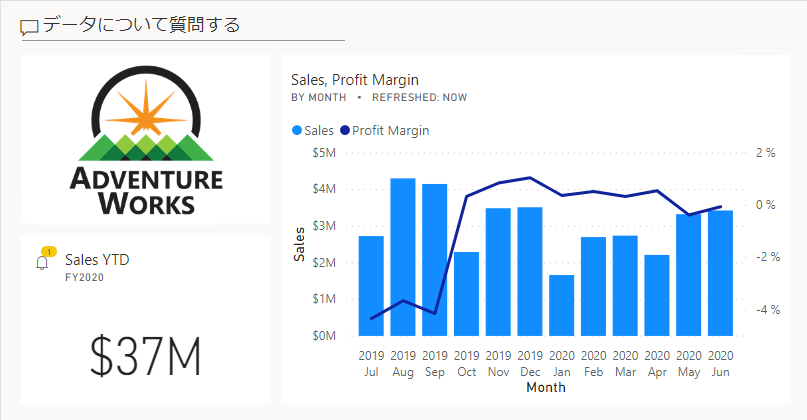

### **タスク 1: 開始する – サインイン**

このタスクでは、Power BI にサインインしてこのラボ用の環境を設定します。

*重要: 前の実習で Power BI にすでにサインインしている場合は、次のタスクから続行してください。*

1. Microsoft Edge を開くには、タスク バーの Microsoft Edge プログラムのショートカットをクリックします。

    

2. Microsoft Edge ブラウザー ウィンドウで **https://powerbi.com** に移動します。

    *ヒント: Microsoft Edge のお気に入りバーで Power BI サービスのお気に入りを使用することもできます。*

3. 「**サインイン**」 (右上隅) をクリックします。

    

4. 提供されたアカウント詳細を入力します。

5. パスワードを更新するように求められたら、指定されたパスワードを再入力し、新しいパスワードを入力して確認します。

    *重要: 新しいパスワードを必ず記録してください。*

6. サインイン プロセスを完了します。

7. Microsoft Edge からサインインを維持するかどうかを確認するメッセージが表示されたら、「**はい**」をクリックします。

8. Microsoft Edge ブラウザー ウィンドウの Power BI サービスの「**ナビゲーション**」ウィンドウで、「**マイ ワークスペース**」を展開します。

    

9. Microsoft Edge ブラウザー ウィンドウを開いたままにします。

### **タスク 2: 開始する – レポートの作成**

このタスクでは、スターター レポートを開いてこのラボ用の環境を設定します。

*重要: 前のラボから継続している (およびそのラボを完了している) 場合は、このタスクを完了しないで、次のタスクから続けてください。*

1. Power BI Desktop を開くには、タスク バーにある Microsoft Power BI Desktop のショートカットをクリックします。

    

2. 「はじめに」ウィンドウを閉じるには、ウィンドウの左上にある「**X**」をクリックします。

    

3. Power BI Desktop が Power BI サービスにサインインしていない場合は、右上の「**サインイン**」をクリックします。

    

4. Power BI サービスへのサインインに使用したものと同じアカウントを使用して、サインイン プロセスを完了します。

5. スターター Power BI Desktop ファイルを開くには、「**ファイル**」リボン タブをクリックして、バックステージ ビューを開きます。

6. 「**レポートを開く**」を選択します。

    

7. 「**レポートを参照**」をクリックします。

    

8. 「**開く**」ウィンドウで、**D:\DA100\Labs\09-create-power-bi-dashboard\Starter** フォルダーに移動します。

9. **Sales Analysis** ファイルを選択します。

10. 「**開く**」をクリックします。

    

11. 開いている情報ウィンドウをすべて閉じます。

12. ファイルのコピーを作成するには、「**ファイル**」リボン タブをクリックして、バックステージ ビューを開きます。

13. 「**名前を付けて保存**」を選択します。

    

14. 変更を適用するかどうかを確認するメッセージが表示されたら、「**適用**」をクリックします。

    

15. 「**名前を付けて保存**」ウィンドウで、**D:\DA100\MySolution** フォルダーに移動します。

16. 「**保存**」をクリックします。

    

### **タスク 3: 開始する – レポートの発行**

このタスクでは、データセットを作成してこのラボ用の環境を設定します。

*重要: **Power BI デスクトップでのレポートの設計、パート 2** ラボでレポートをすでに発行している場合は、次のタスクから続行してください。*

1. Microsoft Edge ブラウザー ウィンドウの Power BI サービスの「**ナビゲーション**」ウィンドウで、「**マイ ワークスペース**」を展開します。

    

2. 「**ファイル**」タイルで、「**取得**」をクリックします。

    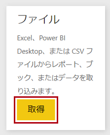

3. 「**ローカル ファイル**」タイルをクリックします。

    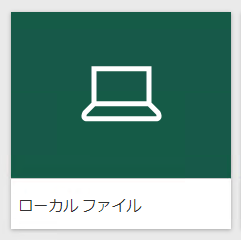

4. 「**開く**」ウィンドウで、**D:\DA100\Labs\08-design-report-in-power-bi-desktop-enhanced\Solution** フォルダーに移動します。

5. **Sales Analysis.pbix** ファイルを選択し、「**開く**」をクリックします。

6. データセットを置き換えるメッセージが表示されたら、「**置換**」をクリックします。

### **タスク 4: ダッシュボードを作成する**

このタスクでは、**売上モニタリング** ダッシュボードを作成します。レポートからビジュアルをピン留めし、画像データの URI に基づいてタイルを追加し、Q&A を使用してタイルを作成します。

1. Microsoft Edge ブラウザー ウィンドウの Power BI サービスで、**販売分析** レポートを開きます。

2. 「**概要**」ページで、「**Year**」スライサーを「**FY2020**」に設定します。

    

3. 「**Region**」スライサーを「**すべて選択**」に設定します。

    *ビジュアルをダッシュボードにピン留めする場合、現在のフィルター コンテキストが使用されます。ピン留めした後は、フィルター コンテキストを変更できません。時間ベースのフィルターの場合は、相対日付スライサー (または、相対時間ベースの質問を使用した Q&A) を使用することをお勧めします。*

4. ダッシュボードを作成してビジュアルをピン留めするには、 **月別売上と利益率** (縦棒/折れ線) ビジュアルにカーソルを合わせます。

5. 右上隅にあるプッシュピンをクリックします。

    

6. 「**ダッシュボードにピン留め**」ウィンドウの「**ダッシュボード名**」ボックスに、「**売上モニタリング**」と入力します。

    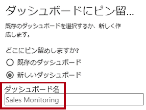

7. 「**ピン留め**」をクリックします。

    

8. 「**ナビゲーション**」ウィンドウを開き、 **売上モニタリング** ダッシュボードを開きます。

    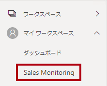

9. ダッシュボードには 1 つのタイルがあることがわかります。

    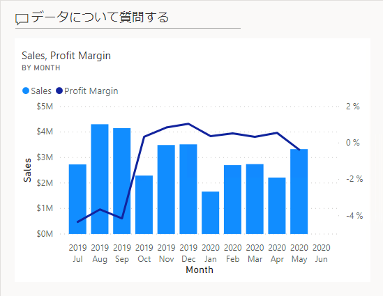

10. 質問に基づいてタイルを追加するには、ダッシュボードの左上にある「**データに関する質問をする**」をクリックします。

    

    *Q&A 機能を使用して質問することができ、Power BI はビジュアルを使用して応答します。*

11. 青色のボックスの Q&A ボックスの下にある、おすすめの質問のいずれかをクリックします。

12. 応答を確認します。

13. Q&A ボックスからすべてのテキストを削除します。

14. Q&A ボックスに、次のように入力します。**売上 YTD**

    

15. 「**(空白)**」の応答に注意してください。

    

    ***Power BI Desktop での DAX 計算の作成、パート 2** ラボで、「**Sales YTD**」メジャーを作成したことを思い出すかもしれません。このメジャーはタイム インテリジェンス式であり、結果を生成するには **Date** テーブルにフィルターを適用する必要があります。*

16. **2020 年度** に質問を拡張してください。

    

17. 応答が **3,300 万ドル** になったことを確認してください。

    

18. 応答をダッシュボードに固定するには、右上隅の「**ビジュアルをピン留めする**」をクリックします。

    

19. タイルをダッシュボードにピン留めするかどうかを確認するメッセージが表示されたら、「**ピン留め**」をクリックします。

    

20. ダッシュボードに戻るには、左上隅にある「**Q&amp;A を終了する**」をクリックします。

    

21. 会社のログを追加するには、メニュー バーの「**編集**」をクリックし、「**タイルの追加**」をクリックします。

    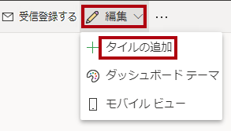

    *この方法を使用してダッシュボード タイルを追加すると、ウェブ コンテンツ、画像、豊富な書式付きテキスト ボックス、動画 (YouTube や Vimeo のリンクを使用) などのメディアをダッシュボードに埋め込むことができます。*

22. 右側にある「**タイルの追加**」ウィンドウで「**画像**」タイルを選択します。

    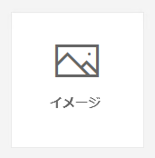

23. 「**次へ**」をクリックします。

    

24. 「**画像タイルの追加**」ウィンドウの「**URL**」ボックスに、**D:\DA100\Resources\AdventureWorksLogo_DataURL.txt** ファイルにある完全な URL を入力します。

    *URL を使用して画像を埋め込むことも、コンテンツをインラインに埋め込むデータ URL を使用することもできます。*

25. ウィンドウの下部で、「**適用**」をクリックします。

    

26. ロゴ タイルのサイズを変更するには、右下隅をドラッグし、タイルのサイズを 1 単位の幅、2 単位の高さに変更します。

    *タイル サイズは、長方形の図形に制限されます。長方形の倍数にしかサイズ変更できません。*

27. ロゴが左上に表示され、その下に「**売上 YTD**」タイル、右に「**売上、利益率**」タイルが表示されるようにタイルを編成します。

    

### **タスク 5: タイルの詳細を編集する**

このタスクでは、2 つのタイルの詳細を編集します。

1. カーソルを「**売上 YTD**」タイルの上に置いてから、タイルの右上にある省略記号をクリックして、「**詳細の編集**」を選択します。

    

2. 「**タイルの詳細**」ウィンドウ (右側) の 「**サブタイトル**」ボックスに「**FY2020**」と入力します。

    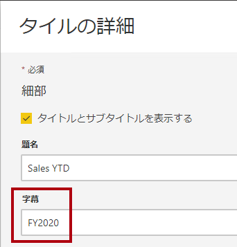

3. 「**適用**」をクリックします。

    

4. 「**売上 YTD**」タイルにサブタイトルが表示されることに注意してください。

    

5. 「**売上、利益率**」タイルの、タイルの詳細を編集します。

6. 「**タイルの詳細**」ウィンドウの「**機能**」セクションで、「**最終更新日時の表示**」をオンにします。

    

7. 「**適用**」をクリックします。

    

8. タイルに最終更新日時 (Power BI Desktop でデータ モデルを読み込むときに行ったもの) が表示されていることに注意してください。

    *このラボの後半でデータの更新をシミュレートし、更新日時が更新されることを確認します。*

### **タスク 6: アラートを構成する**

このタスクでは、データ アラートを構成します。

データ アラートはダッシュボード タイル上でのみ構成でき、具体的には 1 つの数値を表示するタイル上でのみ構成できます。

1. 「**売上 YTD**」タイルにカーソルを合わせ 、省略記号をクリックして、「**アラートの管理**」を選択します。

    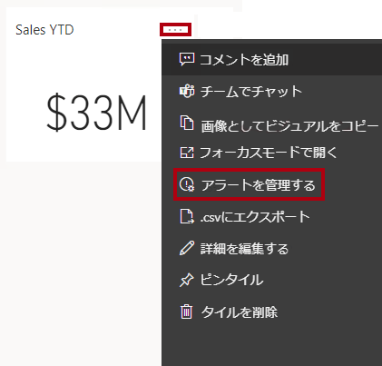

2. 「**アラートの管理**」ウィンドウ (右側) で、「**アラート ルールの追加**」をクリックします。

    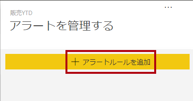

3. 「**しきい値**」ボックスで、値を **35000000** (3,500 万) に置き換えます。

    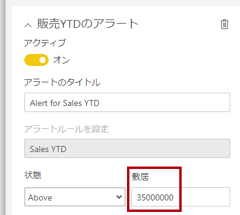

    *この構成により、タイルが 3,500 万を超える値に更新されるたびに通知が必ず送信されます。*

4. ウィンドウの下部にある「**保存して閉じる**」をクリックします。

    

    *次の演習では、データセットを更新します。通常、この処理はスケジュールされた更新を使用して実行されます。この場合、Power BI はゲートウェイを使用して SQL サーバー データベースに接続します。ただし、教室のセットアップの制約により、ゲートウェイはありません。Power BI Desktop を開き、手動でデータ更新を実行し、ワークスペースにファイルをアップロードします。*

## **演習 2: データセットの更新**

この演習では、最初に 2020 年 6 月の受注データを **AdventureWorksDW2020** データベースに読み込みます。次に、Power BI Desktop ファイルを開き、データ更新を実行し、ワークスペースにファイルをアップロードします。

### **タスク 1: ラボ データベースを更新する**

このタスクでは、PowerShell スクリプトを実行して、**AdventureWorksDW2020** データベースのデータを更新します。

1. エクスプローラーの **D:\DA100\Setup** フォルダー内で、**UpdateDatabase-2-AddSales.ps1** ファイルを右クリックし、「**PowerShell で実行**」を選択します。

    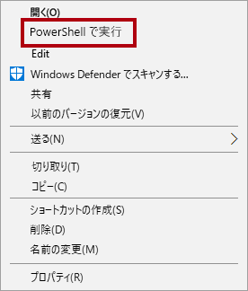

2. 実行ポリシーの変更を求めるメッセージが表示されたら、**A** キーを押します。

3. キーを押して閉じるように求められたら、**Enter** をもう一度押します。

    ***AdventureWorksDW2020** データベースには、2020 年 6 月に行われた販売注文が含まれるようになりました。*

### **タスク 2: Power BI Desktop ファイルを最新の情報に更新する**

このタスクでは、**Sales Analysis** Power BI Desktop ファイルを開き、データの更新を実行し、そのファイルを **販売分析** ワークスペースにアップロードします。

1. メジャーを作成するには、「**フィールド**」ウィンドウで **Sales**」テーブルを右クリックし、「**データの更新**」を選択します。

    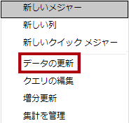

2. 更新が完了したら、Power BI Desktop ファイルを保存します。

3. ワークスペースにファイルを発行するには、「**ホーム**」リボン タブの「**共有**」グループ内から「**発行**」をクリックします。

    

4. データセットを置き換えるメッセージが表示されたら、「**置換**」をクリックします。

    

    *Power BI サービスのデータセットに 2020 年 6 月の売上データが追加されました。*

5. Power BI Desktop を閉じます。

## **演習 3：ダッシュボードの確認**

この演習では、ダッシュボードを確認して、更新された売上を確認し、アラートがトリガーされたことを確認します。

### **タスク 1: ダッシュボードを確認する**

このタスクでは、ダッシュボードを確認して、更新された売上を確認し、アラートがトリガーされたことを確認します。

1. Microsoft Edge ブラウザー ウィンドウの Power BI サービスで、**売上モニタリング** ダッシュボードを確認します。

2. **売上、利益幅** タイルのサブタイトルで、データが  **今** 更新されたことを確認します。

3. また **2020 年 6 月**の列が表示されていることにも注目してください。

    *2020 年 6 月のデータが表示されない場合は、**F5** キーを押してウェブ ブラウザーを再読み込みしてください。*

    

    ***売上 YTD** タイルのアラートもトリガーされているはずです。しばらくすると、現在の売上が構成済みのしきい値を超えたことがアラートによって通知されます。*

4. **売上 YTD** タイルが **$37M** に更新されたことを確認します。

5. **売上 YTD** タイルにアラート通知アイコンが表示されていることを確認します。

    *通知が表示されない場合は、**F5** キーを押してブラウザーをリロードしてください。それでも通知が表示されない場合は、しばらく待ちます。*

    

    *アラート通知がダッシュボード タイルに表示され、電子メールで配信したり、Apple Watch などのモバイル アプリに通知をプッシュしたりすることができます。*

6. ウェブ ページの右上隅にある「**通知**」アイコンをクリックします。

    

7. 「**すべての通知**」ウィンドウで、アラート通知の詳細を確認します。

8. ウィンドウを閉じるには、「**閉じる**」をクリックします。
