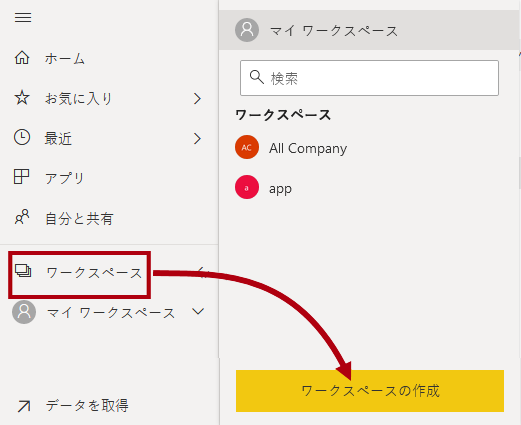
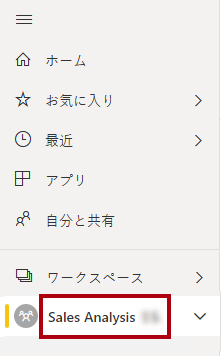
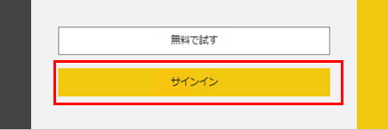
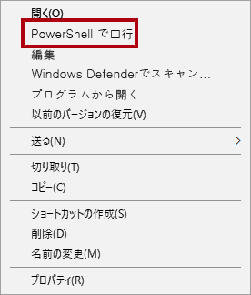



### ラボ 01A

はじめに

# 概要

**ラボを完了するための所要時間: 15 分**

このラボでは、クラスの仮想マシンに接続し、環境をセットアップします。このラボを開始する前に、アカウントとパスワードを受け取っている必要があります。提供されたアカウントを使用してラボを完了することが重要です。

このラボでは、次の方法を学習します。

* Power BI サービスにログインする

* ワークスペースを作成する

* Power BI Desktop を開く

# 演習 1: はじめに

この演習では、クラスの仮想マシンに接続し、環境をセットアップします。

### タスク 1: アカウントの詳細を記録する

このタスクでは、**MySettings.txt** ファイルを開き、アカウントの詳細を記録します。

*インストラクターから提供されたアカウントを使用してすべてのラボを完了することが重要です。アカウントが提供されなかった場合は、https://powerbi.microsoft.com/ja-jp/documentation/powerbi-admin-signing-up-for-power-bi-with-a-new-office-365-trial を参照し、このラボを続ける前にアカウントを作成する手順に従ってください*。

1. Explorer を開くには、タスク バーで 「Explorer」 プログラムのショートカットをクリックします。

    

2. エクスプローラーで、**D:\DA100\Setup** フォルダーに移動します。

3. **MySettings.txt** ファイルを開くには、ファイルをダブルクリックします。

4. **MySettings.txt** ファイルで、ラベルの横にアカウント名とパスワードを入力します。

    

5. **MySettings.txt** ファイルを保存するには、「**ファイル**」 メニューの 「**保存**」 を選択します (または**Ctrl + S**を押します)。

6. **MySettings.txt** ファイルを開いたままにしておきます。

7. エクスプローラーを開いたままにしておきます。

### タスク 2: Power BI サービスにログインする

このタスクでは、Power BI サービスにサイン インします。

1. Microsoft Edge を開くには、タスク バーの Microsoft Edge プログラムのショートカットをクリックします。

    

2. Microsoft Edge で、**http://powerbi.com** に移動します。

    *ヒント: Microsoft Edge のお気に入りバーで Power BI サービスのお気に入りを使用することもできます*。

3. **「サイン イン」** (右上隅) をクリックします。

    

4. **MySettings.txt**ファイルからアカウントの詳細を入力します。

5. パスワードを更新するように求められたら、指定されたパスワードを再入力し、新しいパスワードを入力して確認します。**MySettings.txt** ファイルを新しいパスワードで更新してください。

6. サインイン プロセスを完了します。

7. Microsoft Edge からサインインを維持するかどうかを確認するメッセージが表示されたら、「**はい**」 をクリックします。

8. Power BI サービスの右上隅にある「新しい外観」が有効になっていない場合は、スライダー コントロールをクリックしてオンにします。

    

9. Microsoft Edge ウィンドウは開いたままにします。

  
 

### タスク 3: ワークスペースを作成する

このタスクでは、ワークスペースを作成します。また、アカウントを Power BI Pro にアップグレードします。

*このコースで開発したすべてのコンテンツがこのワークスペースに追加されます。*

1. ワークスペースを作成するには、**ナビゲーション** ペイン (左側) で 「**ワークスペース**」 をクリックし、「**ワークスペースの作成**」 をクリック します。

    

2. アカウントを Power BI Pro にアップグレードするかどうかを確認するメッセージが表示されたら、「**無料で試す**」 をクリックします。

    

    *ワークスペースを作成して作業するには、Power BI Pro ライセンスが必要です。コンテンツを共有する際にも必要です。トライアルでは、最大 60 日間 Pro 機能を使用できます。*

3. 60 日間の無料の Pro 試用版を開始するように求められたら、「**試用を開始する**」 をクリックします。

    

4. トライアルが延長されたら、「**閉じる**」 をクリックします。

5. ワークスペースを作成するには、このタスクの最初の手順を繰り返します。

6. 「**ワークスペースの作成**」 ペイン（右側）で、「**ワークスペース名**」 ボックスにワークスペースの名前を入力します。

    *入力する名前は、テナント内で一意である必要があります。ワークスペースに 「**売上分析**」という名前を付け、イニシャルも追加することをお勧めします。たとえば、名前は **売上分析 AB***とすることができます。

7. ワークスペースを作成するには、ペインの下部にある 「**保存**」 をクリック します。

    

8. 「**ナビゲーション**」 ペインで、ワークスペースが開いていることがわかります。

    

9. **ラボ 03D** のワークスペースにコンテンツを発行します。

  
 

### タスク 4: Power BI Desktop を開く

このタスクでは、Power BI Desktop を開き、自身のアカウントを使用してサインインします。

1. Power BI デスクトップを開くには、タスク バーで、Microsoft Power BI Desktop ショートカットをクリックします。

    

2. メッセージが表示されたら、「**サインイン**」 をクリックします。

    

3. **MySettings.txt** アカウントの詳細を使用してサインイン プロセスを完了します。

4. Power BI Desktop の右上隅に、アカウントが表示されていることを確認します。

    

5. Power BI Desktop を開いたままにしておきます。

    ***ラボ 02A***でデータ モデルの開発を開始します。

  

### タスク 5: ラボ データベースを更新する

このタスクでは、PowerShell スクリプトを実行して、**AdventureWorksDW2020** データベースのデータを更新します。

1. エクスプローラーの **D:\DA100\Setup** フォルダー内で、**UpdateDatabase-1-UpdateAccount.ps1** ファイルを右クリックし、「**PowerShell で実行**」を選択します。

    

2. 「**Windows PowerShell**」 ウィンドウで、アカウントの入力を求めるメッセージが表示されたら、**MySettings.txt**ファイルからアカウント名を貼り付けます。

    *ヒント: **Windows PowerShell** ウィンドウに 貼り付けるには、**アカウント** プロンプト*で右クリックします。

    

3. データベースを更新するには、**Enter** キーを押します。

4. キーを押して続行するように求められたら、**Enter** をもう一度押します。 

    *アカウントの詳細を使用するように **AdventureWorksDW2020** データベースが更新されました。これで、あなたは販売員の Michael Blythe になりました。その販売実績は、3 つの販売地域の販売によって測定されます。米国北東部、米国中部、米国南東部*。

    *ここで実行した内容は、 **Lab 03B*** で行レベルのセキュリティを実装する際に関連付けられます。
