

### ラボ 04A

Power BI Desktop でのデータ モデリング

# 概要

**ラボを完了するための所要時間は 45 分です**

このラボでは、データ モデルの開発を開始します。テーブル間のリレーションシップを作成し、テーブルと列のプロパティを構成して、データ モデルの親しみやすさと使いやすさを向上させます。また、階層を作成し、クイック メジャーを作成します。

このラボでは、次の方法を学習します。

* モデルの関係を作成する

* テーブルと列のプロパティを構成する

* 階層を作成する

* クイック メジャーを作成する

# 演習 1: モデルの関係を作成する

この演習では、モデルの関係を作成します。

前のラボを正常に完了した自信がない場合は、**D:\DA100\Lab03A\Solution** フォルダーにある前のラボのソリューション ファイルを開くことができます。

### タスク 1: モデルの関係を作成する

このタスクでは、モデルのリレーションシップを作成します。

1. Power BI Desktop の左側で、「**モデル**」 ビュー アイコンをクリックします。

	

2. 7 つのテーブルがすべて表示されない場合は、左右に右にスクロールし、テーブルをまとめてドラッグして整列して、すべてのテーブルを同時に表示できるようにします。

	*モデル ビューでは、各テーブルと関係 (テーブル間のコネクタ) を表示できます。現在、**Lab 02A** でデータロード関係オプションを無効にしたため、関係はありません*。

3. 「レポート」 ビューに戻るには、左側の 「**レポート**」 ビュー アイコンをクリックします。

	

4. すべてのテーブル フィールドを表示するには、「**フィールド**」 ペインで空の領域を右クリックし、「**すべて展開**」 を選択します。

	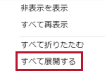

5. テーブルのビジュアルを作成するには、「**フィールド**」 ペインの 「**Product**」 テーブル内から、「**Category**」 フィールドをチェックします。

	

	*これ以降、ラボではフィールドの参照に省略表記を使用します。次のようになります。**Product | Category***。

6. テーブルに列を追加するには、「**フィールド**」 ペインで、**Sales | Sales** をチェックします。

7. 表のビジュアルには 4 つの製品カテゴリがリストされており、売上値はそれぞれ同じで、合計も同じであることに注意してください。

	

	*問題は、テーブルが異なるテーブルのフィールドに基づいていることです。各製品カテゴリには、そのカテゴリの売上が表示されることが期待されています。ただし、これらのテーブル間にはモデルの関係がないため、**Sales** テーブルはフィルタリングされません。ここで、テーブル間でフィルターを伝播するための関係を追加します*。

8. 「**モデリング**」 リボン タブの 「**リレーションシップ**」 グループ内から、「**リレーションシップの管理**」 をクリックします。

	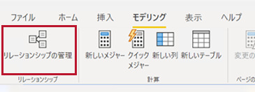

9. 「**リレーションシップの管理**」 ウィンドウで、まだ関係が定義されていないことに注意してください。

10. リレーションシップを作成するには、「**新規作成**」 をクリックします。

	

11. 「**リレーションシップの作成**」 ウィンドウの最初のドロップダウン リストで、「**Product**」 テーブルを選択します。

	

12. 2 番目のドロップダウン リスト（**Product** テーブル グリッドの下）で、**Sales** テーブルを選択します。

	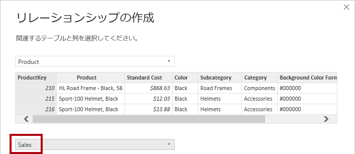

13. 各テーブルの 「**ProductKey**」 列が選択されていることに注意してください。

	*列は同じ名前を共有しているため、自動的に選択されました*。

14. 「**カーディナリティ**」 ドロップダウン リストで、「**一対多**」 が選択されていることに注意してください。

	*Power BIは **Product** テーブルの **ProductKey** 列に一意の値が含まれていると認識しているため、カーディナリティは自動的に検出されました。1 対多の関係は最も一般的なカーディナリティであり、このラボで作成するすべての関係はこのタイプになります。**Lab 05A*** で多対多のカーディナリティを使用します。

15. 「**クロス フィルターの方向**」 ドロップダウン リストで、「**単一**」 が選択されていることを確認します。  

	*単一フィルター方向とは、フィルターが「片側」から「多辺」に伝播することを意味します。この場合、**Product** テーブルに適用されたフィルターは **Sales** テーブルに伝播しますが、他の方向には伝播しません。**Lab 05A*** で双方向関係を使用します。

16. 「**このリレーションシップをアクティブにする**」 がオンになっていることを確認します。 

	*アクティブな関係はフィルタを伝達します。関係を非アクティブとしてマークして、フィルターが伝搬しないようにすることができます。テーブル間に複数のリレーションシップパスがある場合、非アクティブなリレーションシップが存在する可能性があります。その場合、モデル計算は特別な関数を使用してアクティブ化できます。**Lab 05A*** で非アクティブな関係で作業します。

17. 「**OK**」 をクリックします。

	

18. 「**リレーションシップの管理**」 ウィンドウで、新しいリレーションシップが表示されていることを確認し、「**閉じる**」 をクリックします。   

	

19. レポートでは、テーブル ビジュアルが更新され、製品カテゴリごとに異なる値が表示されていることを確認します。

	

20. 「**Product**」 テーブルに適用されたフィルターは、「**Sales**」 テーブルに伝達されるようになりました。

21. モデル ビューに切り替えると、2 つのテーブル間にコネクタが存在することに気付きます。

	

22. この図では、**1** および **\*** インジケーターで表されるカーディナリティーを解釈できることに注意してください。

	*フィルターの方向は矢印の頭で表されます。実線はアクティブな関係を表します。破線は非アクティブな関係を表します*。

23. 関係にカーソルを合わせると、関連する列が表示されます。

	*関係を作成する簡単な方法があります。モデル ダイアグラムでは、列をドラッグ アンド ドロップして新しい関係を作成できます*。

24. 新しいリレーションシップを作成するには、「**Reseller**」 テーブルから、「**ResellerKey**」 列を 「**Sales**」 テーブルの 「**ResellerKey**」 列にドラッグします。

	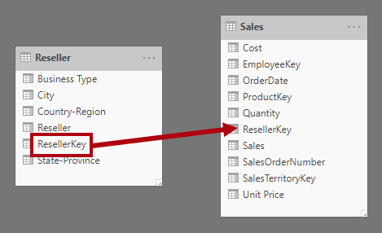

	*ヒント: 列をドラッグしたくない場合があります。この状況が発生した場合は、別の列を選択してから、もう一度ドラッグする列を選択して、再試行してください*。

25. 次の 2 つのモデル関係を作成します。

	* **Region | SalesTerritoryKey** から **Sales | SalesTerritoryKey**

	* **Salesperson | EmployeeKey** から **Sales | EmployeeKey**

	*このラボでは、**SalespersonRegion** および **Targets** テーブルは切断されたままです。営業担当者と地域の間には多対多の関係があります。この高度なシナリオは次のラボで行います*。

26. ダイアグラムで、**Sales** テーブルを中央に配置し、関連するテーブルを配置します。 

	

27. Power BI Desktop ファイルを保存します。

# 演習 2: テーブルの構成

この演習では、階層を作成し、列を非表示、フォーマット、および分類して、各テーブルを構成します。

### タスク 1: 製品テーブルを構成する

このタスクでは、**Product** テーブルを構成します。

1. モデル ビューの 「**フィールド**」 ウィンドウで、必要に応じて 「**Product**」 テーブルを展開します。   

2. 階層を作成するには、「**フィールド**」 ウィンドウで 「**Category**」 列を右クリックし、「**階層の作成**」 を選択 します。

	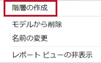

3. 「**プロパティ**」 ウィンドウ (「**フィールド**」 ペインの左側) の 「**名前**」 ボックスで 、テキストを **Products** に置き換えます。       

	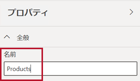

4. 階層に 2 番目のレベルを追加するには、「**階層**」 ドロップダウン リストで 「**Subcategory**」 を選択します。   

5. 3 番目のレベルを階層に追加するには、「**階層**」 ドロップダウン リストで、「**Product**」 を選択します。

6. 階層の設計を完了するには、「**レベル変更の適用**」 をクリックします。

	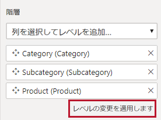

	*ヒント: 「**レベルの変更を適用**」 をクリックすることを忘れないでください。この手順を見落とすことはよくある間違いです。*

7. 「**フィールド**」 ペインで、「**Products**」 階層に注目してください。

	

8. 階層レベルを表示するには、**Products**階層を展開します。

	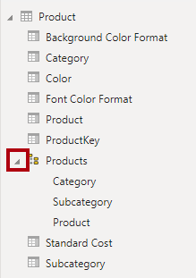

9. 列を表示フォルダーに編成するには、**フィールド** ペインで、まず**Background Color Format**列を選択します。

10. **Ctrl** キーを押しながら、「**Font Color Format**」 を選択します。

11. 「**プロパティ**」 ペインの 「**フォルダーの表示**」 ボックスに、「**Formatting**」と入力します。

	

12. **フィールド** ペインで、2 つの列がフォルダー内にあることに注意してください。

	

	*表示フォルダーは、テーブル、特に多くのフィールドを含むテーブルを整理するのに優れた方法です*。

### タスク 2: 地域テーブルの設定

このタスクでは、**地域**テーブルを構成します。

1. **Region**テーブルで、次の 3 つのレベルを持つ **Regions** という名前の階層を作成します。

	* Group

	* Country

	* Region

	

2. 階層の中の**Country**レベルではなく、**Country**列を選択します。

3. 「**プロパティ**」 ペインで 「**詳細**」 セクションを展開し、「**データ カテゴリ**」 ドロップダウン リストから 「**国/地域**」 を選択します。

	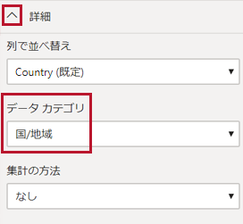

	*データの分類は、レポート デザイナーにヒントを提供できます。この場合、列を国または地域として分類すると、マップの視覚化をレンダリングするときに、より正確な情報が提供されます*。

### タスク 3: リセラー テーブルを構成する

このタスクでは、**リセラー** テーブルを構成します。

1. **Reseller** テーブルで、次の 2 つのレベルを持つ **Resellers** という名前の階層を作成します。

	* Business Type

	* Reseller

	

2. **geography** という名前の 2 つ目の階層を作成します。次の 4 つのレベルがあります。

	* Country-Region

	* State-Province

	* City

	* Reseller

	

3. 次の 3 つの列を分類します。

	* **Country-Region** (**Country/Region**)

	* **State-Province** (**State or Province**)

	* **City** は **City** とし

### タスク 4: 売上テーブルの構成

このタスクでは、**Sales** テーブルを構成します。

1. **Sales** テーブルで、**Cost** 列を選択します

2. 「**プロパティ**」 ペインの 「**説明**」 ボックスに、次のように入力します。**標準原価に基づく**

	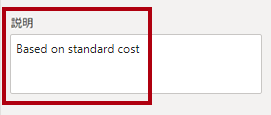

	*説明は、テーブル、列、階層、またはメジャーに適用できます。**フィールド** ペインでは、レポートの作成者がカーソルをフィールドの上に置くと、ツールチップに説明テキストが表示されます*。

3. **Quantity**列を選択します。

4. **プロパティ** ペインの **書式設定** セクション内から、**桁区切り記号** プロパティを **はい** にスライドします。

	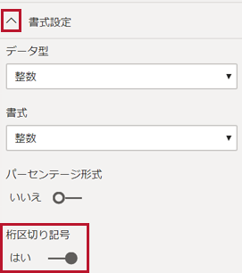

5. 「**UnitPrice**」 列を選択します。 

6. 「**プロパティ**」 ペインの 「**書式設定**」 セクション内で、「**小数点以下表示桁数**」 プロパティを **2** にスライドします。

7. 「**詳細**」 グループ (下にスクロールして配置する必要がある場合があります) の 「**集計の方法**」 ドロップダウン リストで、「**平均**」 を選択します。

	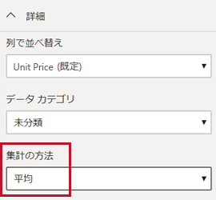

	*既定では、数値列は値を合計して集計されます。このデフォルトの動作は、レートを表す**単価**のような列には適していません。デフォルトの要約を平均に設定すると、有用で正確な結果が得られます*。

### タスク 5: プロパティの一括更新

このタスクでは、1 回の一括更新で複数の列を更新します。このアプローチを使用して、列を非表示にし、列の値をフォーマットします。

1. 「**Ctrl**」 キーを押しながら、次の 13 列 (複数のテーブルにまたがる) を選択します。

	* Product | ProductKey

	* Region | SalesTerritoryKey

	* Reseller | ResellerKey

	* Sales | EmployeeKey

	* Sales | ResellerKey

	* Sales | SalesOrderNumber

	* Sales | SalesTerritoryKey

	* Salesperson | EmployeeID

	* Salesperson | EmploeyeeKey

	* Salesperson | UPN

	* SalespersonRegion | EmploeyeeKey

	* SalespersonRegion | SalesTerritoryKey

	* ターゲット | EmployeeID

2. 「**プロパティ**」 ペインで、「**非表示**」 プロパティを 「**はい**」 にスライドします。

	

	*列はリレーションシップによって使用されるか、行レベルのセキュリティ構成または計算ロジックで使用されるため、非表示に設定されました*。

***UPN** 列を使用して、次のラボで行レベルのセキュリティを定義します。**Lab 06A** での計算には **SalesOrderNumber** を使用します*。

3. 次の列を複数選択します。

	* Product | Standard Cost

	* Sales | Cost

	* Sales | Sales

4. 「**Properties**」 ペインの 「**書式設定**」 セクション内から、「**小数点以下表示桁数**」 プロパティを **0** (ゼロ) に設定します。

	

# 演習 3: モデル インターフェイスの確認

この演習では、レポート ビューに切り替えて、モデルのインターフェイスを確認します。

### タスク 1: モデル インターフェイスの確認

このタスクでは、レポート ビューに切り替えて、モデル インターフェイスを確認します。

1. レポートビューに切り替えます。

2. 「**フィールド**」 ペインで、次のことに注意してください。

	* 列、階層、およびそれらのレベルはフィールドであり、レポートのビジュアルを構成するために使用できます

	* レポートの作成に関連するフィールドのみが表示されます

	* **SalespersonRegion** テーブルは表示されません。そのフィールドがすべて非表示になっているためです

	* **Region** および **Reseller** テーブルの空間フィールドは、空間アイコンで装飾されています

	* シグマ記号 (Ʃ)で飾られたフィールドは、既定で要約されます

	* カーソルを **Sales**| **Cost** の上に置くと、ツールチップが表示されます フィールド

3. 「**Sales | OrderDate**」 フィールドを展開すると、日付の階層が表示されます。

	

	*「**Targets | TargetMonth**」 は同じ階層を示します。これらの階層は、ユーザーが作成したものではありません。これらは自動的に作成されます。しかし、問題があります。Adventure Works の会計年度は、毎年 7 月 1 日に始まります。しかし、日付階層の年は毎年 1 月 1 日に始まります*。

	*この自動動作をオフにします。**Lab 06A** では、DAX を使用して日付テーブルを作成し、Adventure Works のカレンダーを定義するように構成します*。

4. 自動時刻/日付時刻をオフにするには、「**ファイル**」 リボン タブをクリックして、Backstage ビューを開きます。

5. 左側の 「**オプションと設定**」 を選択し、「**オプション**」 を選択します。

	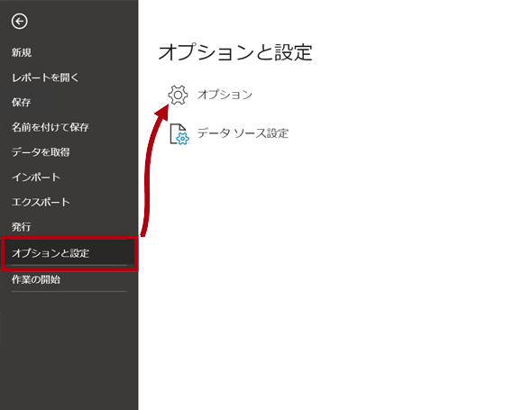

6. 左側にある 「**オプション**」 ウィンドウの 「**現在のファイル**」 グループで、「**データの読み込み**」 を選択します。

	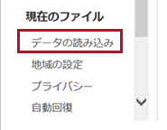

7. 「**タイム インテリジェンス**」 セクションで、「**自動の日付/時刻**」 のチェックを外します。

	

8. 「**OK**」 をクリックします。

	

9. 「**フィールド**」 ペインで、日付階層が使用できなくなっていることに注意してください。

	

# 演習 4: クイック メジャーの作成

この演習では、2 つのクイック メジャーを作成します。

### タスク 1: クイック メジャーを作成する

このタスクでは、利益と利益率を計算する 2 つのクイック メジャーを作成します。

1. 「**フィールド**」 ペインで、「**Sales**」 テーブルを右クリックし、「**新しいクイック メジャー**」 を選択します。

	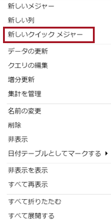

2. 「**クイック メジャー**」 ウィンドウの 「**計算**」 ドロップダウン リストで、「**数値演算**」 グループ内から 「**減算**」 を選択します。

	

3. 「**フィールド**」 ペインで、「**Sales**」 テーブルを展開します。

4. 「**Sales**」 フィールドを 「**基準値**」 ボックスにドラッグします。   

5. 「**Cost**」 フィールドを 「**減算する値**」 ボックスにドラッグします。   

	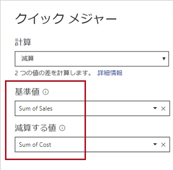

6. 「**OK**」 をクリックします。

	

	*クイック メジャーが計算を作成します。シンプルで一般的な計算を簡単かつ迅速に作成できます。**Lab 06A*** の数式言語を使用して、このツールなしでメジャーを作成します。

7. 「**フィールド**」 ウィンドウの  「**Sales**」 テーブル内で、新しいメジャーに注目します。   

	

	*メジャーは電卓アイコンで飾られています*。

8. メジャーの名前を変更するには、メジャーを右クリックして、「**名前の変更**」 を選択します。

	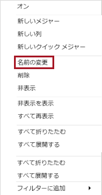

	*ヒント: フィールドの名前を変更するには、フィールドをダブルクリックするか、フィールドを選択して**F2** を押すこともできます*。

9. メジャーの名前を **Profit** に変更し、**Enter** キーを押します。

10. 「**Sales**」 テーブルで、次の要件に基づいて 2 番目のクイック メジャーを追加します。 

	* **除算**算術演算を使用する

	* **numerator** を  「**Sales | Profit**」 フィールドに設定する 

	* **denominator**を**Sales | Sales**フィールドに設定します

	* メジャーの名前を **Profit Margin**として変更する

	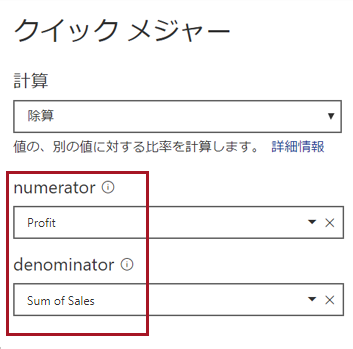

	

11. **Profit Margin** メジャーが選択されていることを確認してから、**メジャーツール** コンテキスト リボンで、書式を小数点以下 **2** 桁の **パーセンテージ** に設定します。  

	

12. 2つのメジャーをテストするには、まずレポートページでテーブル ビジュアルを選択します。

13. 「**フィールド**」 ウィンドウで、2 つのメジャーを確認します。 

	

14. 右のガイドをクリックしてドラッグすると、テーブルのビジュアルが広がります。

	

15. メジャーが適切にフォーマットされた適切な結果を生成することを確認します。

	

### 仕上げ

このタスクでは、ラボを完了します。

1. テーブルを削除するには、テーブルをクリックして (それをクリックして)、**Delete** キーを押します。

2. Power BI Desktop ファイルを保存します。

	*次のラボでは、多対多の関係と行レベルのセキュリティを構成することにより、データ モデルを拡張します*。
