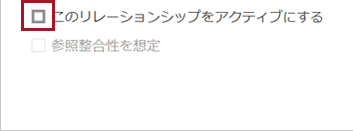
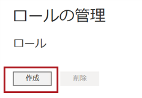
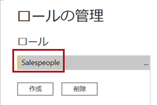
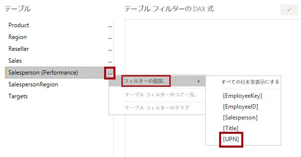
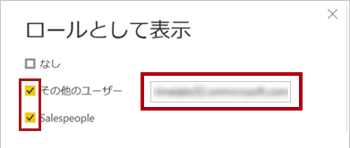



### ラボ 05A

Power BI Desktop における高度なデータ モデリング

# 概要

**ラボを完了するための所要時間は 45 分です**

この演習では、 **営業担当者**テーブルと**営業**テーブルの間に多対多リレーションシップを作成します。 また、行レベルのセキュリティを適用して、営業担当者が割り当てられた地域の売上データのみを分析できるようにします。

このラボでは、次の方法を学習します。

* 多対多の関係を構成する

* 行レベルのセキュリティを実行する

# 演習 1: 多対多のリレーションシップの作成

この演習では、 **営業担当者**テーブルと**営業**テーブルの間に多対多リレーションシップ を作成 します。   

前のラボ内容の習得に自信がない場合は、前のラボのソリューション ファイルを開くことができます。これは、**D:\DA100\Lab04A\Solution** フォルダーにあります。

### タスク 1: 多対多のリレーションシップを作成する

このタスクでは、 **営業担当者**テーブルと**営業**テーブルの間に多対多リレーションシップを作成 します。   

1. Power BI Desktop のレポート ビューの 「**フィールド**」 ウィンドウで、次の 2 つのフィールドを確認してテーブル ビジュアルを作成します。 

	* Salesperson | Salesperson

	* Sales | Sales

	

	*テーブルには、各営業担当者の売上が表示されます。しかし、営業担当者と営業の間には別の関係もあります。営業担当者が所属している販売地域は、1 つに限らないこともあります。さらに、販売地域には複数の営業担当者を割り当てることができます*。

	*業績管理の観点からは、営業担当者の売上を (割り当てられた担当地域に基づいて) 分析し、販売目標と比較する必要があります。この演習では、この分析を行うためのリレーションシップを作成します*。

2. Michael Blythe は約 900 万ドルを売り上げていることに注目してください。

3. モデル ビューに切り替えます。

4. ドラッグ アンド ドロップで、次の 2 つのモデル関係を作成します。

	* **Salesperson | EmploeyeeKey** と **SalespersonRegion | EmploeyeeKey**

	* **Region | SalesTerritoryKey**と**SalespersonRegion | SalesTerritoryKey**

	***SalespersonRegionテーブル** は、 ブリッジ テーブルと見なすことができます*。  

5. レポート ビューに切り替えて、ビジュアルが更新されていない (Michael Blythe の売上結果が変更されていない) ことを確認します。

6. 「モデル」 ビューに戻り 、**Salesperson**テーブルのリレーションシップ フィルターの方向 (矢印) を確認します。

	*たとえば、「**Salesperson**」 テーブルが 「**Sales** 」テーブルにフィルターを適用します。  また **SalespersonRegion** テーブルにもフィルタが適用されますが、 **Region**テーブルには反映されません  (矢印が間違った方向を指しています)。*

	

7. 「**Region**」 テーブルと 「**SalespersonRegion**」 テーブルの間のリレーションシップを編集するには、リレーションシップをダブルクリックします。 

8. 「**リレーションシップの編集**」  ウィンドウの 「**クロス フィルタの方向（Cross filter direction)**」ドロップダウン リストで、「**双方向(both)**」 を選択します。     

9. 「**両方向にセキュリティ フィルタを適用する(Apply security filter in both directions)**」 チェックボックスをオンにします。 

	*この設定により、行レベルのセキュリティが適用されるときに双方向のフィルター処理が適用されます。次の演習でセキュリティ ロールを構成設定します*。

	

10. 「**OK**」 をクリックします。

	

11. リレーションシップに両端に矢印のある線が付いていることに注意してください。

	

12. レポート ビューに切り替えると、販売額が変更されていないことがわかります。

	*この問題は、**Salesperson** テーブルと **Sales** テーブルの間にフィルターを反映させるパスが 2 つあるという事実に関連しています。このあいまいさは、「テーブルの数が最も少ない」という評価観点に基づいて内部的に解決されます。明確に言うと、この種のあいまいさを持つモデル設計は避けるべきです。これについては今回のラボの一部と次のラボで指摘します*。

13. モデル ビューに切り替えます。

14. ブリッジ テーブルを介してフィルターの伝達を強制するには、**Salesperson** テーブルと **Sales** テーブルのリレーションシップをダブルクリック します。

15. 「**リレーションシップの編集**」 ウィンドウで、「**このリレーションシップをアクティブにする(Make this relationship active)**」 チェックボックスをオフにします。   

	

16. 「**OK**」 をクリックします。

	

	*フィルターの伝達が強制的に唯一のアクティブ パスを取得するようになりました。*

17. 図では、非アクティブなリレーションシップが破線で表されていることが分かります。

	

18. レポートビューに切り替えると、Michael Blythe の売り上げが 2,200 万ドル近くになっていることが分かるでしょう。

	

19. また、各営業担当者の売上が合計を上回る場合もあります。

	*これで分かるのは、地域の売上結果の 2 倍、3 倍などにより、多対多の関係になっていることです。2 番目の営業担当者である Brian Welcker について考えてみましょう。彼の売上金額は総販売額と等しくなっています。これは間違っている訳ではなく、彼がセールス ディレクターであるためです。彼の売上は、すべての地域の売上の合計だからです*。

	*多対多リレーションシップは現在機能していますが、営業担当者による販売を分析することはできません (リレーションシップは非アクティブです)。次の演習では、(地域の) 業績分析の営業担当者を表す計算テーブルについて説明します*。

20. 「モデリング」 ビューに切り替え、ダイアグラム上で 「**Salesperson**」 テーブルを選択します。 

21. 「**プロパティ**」 ウィンドウの  「**名前**」 ボックスで 、テキストを **Salesperson (Performance)** に置き換えます。   *Salesperson と (Performance) の間には半角スペースが必要です* 
 
	*名前を変更したテーブルは、割り当てられた販売地域 の販売に基づいて営業担当者の業績を報告し、分析するために使用するという目的を反映します*。

### タスク 2: ターゲット テーブルを関連付ける

このタスクでは **ターゲット** テーブルにリレーションシップを作成します。

1. **Salesperson (Performance) | EmploeyeeID** から  **Target | EmployeeID** 列にリレーションシップを作成します

2. レポート ビューで、 **Targets|Target**を視覚化されたテーブルに追加します。

	視覚化されたテーブルの幅を広げて、すべてのデータを表示します。 

	

3. 売上と目標を視覚化することが可能になりましたが、2 つの点において注意が必要です。まず、期間にフィルターがないため、将来の目標値も含めてターゲットを設定します。次に、ターゲットは加算されていかにので、合計は表示されません。これらは、視覚的な書式設定プロパティを使用して無効にするか、計算ロジックを使用して削除できます。**演習 06B** では、 複数の営業担当者がフィルター処理されたときに BLANK を返す目標を記述します。

# 演習 2: 行レベルのセキュリティの実行

この演習では、営業担当者が割り当てられた地域での売上のみを表示できるように、行レベルのセキュリティを適用します。

### タスク 1: 行レベルのセキュリティを実行する

このタスクでは、行レベルのセキュリティを適用して、営業担当者が割り当てられた地域での売上のみを表示できるようにします。

1. データ ビューに切り替えます。

	

2. 「**フィールド**」 ウィンドウで、「**Salesperson (Performance )**」 テーブルを選択します。   

3. データを見て、Michael Blythe (EmployeeKey 281) に Power BI アカウント (**UPN** 列) が割り当てられていることを確認します。

	*Michael Blythe は 3 つの販売地域に割り当てられていることを思い出してください。米国北東部、米国中部、米国南東部*。

4. レポートビューに切り替えます。

5. 「**モデリング**」 リボン タブの 「**セキュリティ**」 グループの内から、「**ロールの管理（Manage roles）**」 をクリック します。     

	

6. 「**ロールの管理**」 ウィンドウで、「**作成（Create）**」 をクリックします。

	

7. ボックスで、選択したテキストをロールの名前に置き換えます。**Salespeople**を入力します。  

	

8. フィルターを割り当てるには、**Salesperson (Performance)** テーブルの省略記号 (..) 文字をクリックし、「**フィルターの追加**」 を選択します。 | 「**UPN**」。

	

9. 「**テーブル フィルターのDAX 式**」 ボックスで、**"Value"** を **USERNAME()** に置き換えて式を変更します。（"も置き換えの対象です）     

	

	*USERNAME() は、認証されたユーザーを取得するデータ分析式 (DAX) 関数です。つまり、**Salesperson (Performance)** テーブルは、モデルに対してクエリを実行するユーザーのユーザー プリンシパル名 (UPN) でフィルター処理されます*。  

10. 「**保存**」 をクリックします。

	

11. セキュリティ ロールをテストするには、「**モデリング**」 リボン タブの 「**セキュリティ**」 グループ内から、「**表示方法(View as)**」 をクリックします。     

	

12. 「**ロールとして表示(View as roles)**」 ウィンドウで、「**その他のユーザー(Other user**」 項目をオンにし、対応するボックスにアカウント名を入力します。   

	*アカウント名: michael-blythe@adventureworks.com*  

13. **Salespeople**ロールを確認します。 

	

	*この構成では**Salespeople**ロールが使用され、ユーザーのアカウント名を使用してなりすまします*。  

14. 「**OK**」 をクリックします。

	

15. レポート ページの上に黄色のバナーが表示され、テスト セキュリティ コンテキストが説明されています。

	

16. テーブルのビジュアルでは、営業担当者の**Michael Blythe**のみがリストされていることに注目してください。 

	

17. テストを中止するには、黄色のバナーの右側にある 「**表示を中止**」 をクリックします。

	

	*Power BI Desktop ファイルが Power BI サービスに発行されると、公開後のタスクが 行われ、セキュリティ プリンシパルが**営業担当者**ロールに関連付けられます。**ラボ 06B***でこれを行います。

### 仕上げ

このタスクでは、ラボを完了します。

1. Power BI Desktop ファイルを保存します。

2. Power BI Desktop を開いたままにしておきます。

	*次のラボでは、DAX を使用した計算でデータ モデルを拡張します*。
