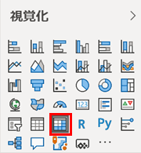
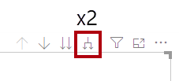
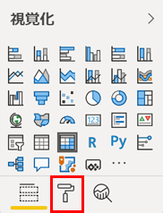
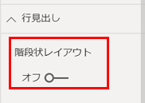
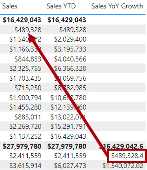
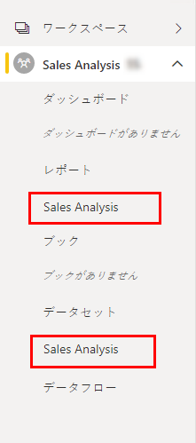
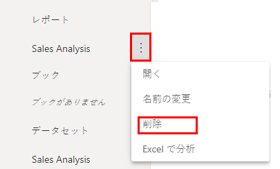



### ラボ 06B

Power BI Desktop での DAX の使用、パート 2

# 概要

**ラボを完了するための所要時間は 45 分です**

このラボでは、フィルター コンテキスト操作を含む DAX 式を使用してメジャーを作成します。

このラボでは、次の方法を学習します。

* CALCULATE() 関数を使用して、フィルター コンテキストを操作する

* タイム インテリジェンス関数の使用

# 演習 1: フィルター コンテキストの操作

この演習では、フィルター コンテキスト操作を含む DAX 式を使用してメジャーを作成します。

前のラボを正常に完了した自信がない場合は、**D:\DA100\Lab06A\Solution**フォルダーにある前のラボのソリューション ファイルを開くことができます。

### タスク 1: マトリックス ビジュアルを作成する

このタスクでは、新しいメジャーのテストをサポートするマトリックス ビジュアルを作成します。

1. Power BI Desktop のレポート ビューで、新しいレポート ページを作成します。

	

2. **ページ 3** で、マトリックス ビジュアルを追加します。 

	

3. マトリックス ビジュアルのサイズを変更して、ページ全体を埋めます。

4. マトリックスのビジュアル フィールドを構成するには、「**フィールド**」 ウィンドウから 「**リージョン**」 をドラッグします ** | リージョン** 階層を作成し、ビジュアル内にドロップします。

5. 「**販売**」 も追加 **|**「**販売**」 フィールド。

6. 階層全体を展開するには、マトリックス ビジュアルの右上にあるフォークされた二重矢印アイコンを 2 回クリックします。

	

	* **リージョン**階層には、 **グループ**、**国**、および **リージョン*** のレベルが含まれることを思い出してください。

7. ビジュアルを書式設定するには、「**視覚化**」 ウィンドウの下にある 「**書式設定**」 ウィンドウを選択します。   

	

8. 「**検索**」 ボックスに、「**階段状**」と入力します。

9. 「**階段状レイアウト**」 プロパティを 「**オフ**」 に設定します。   

	

10. マトリックス ビジュアルに 4 つの列ヘッダーがあることを確認します。

	

	*Adventure Works では、販売地域はグループ、国、地域に分かれています。米国を除くすべての国には、国にちなんで名付けられた 1 つの地域があります。米国は非常に大きな販売地域であるため、5 つの地域に分かれています*。

	*この演習では、いくつかのメジャーを作成し、それらをマトリックス ビジュアル に追加してテストします*。

### タスク 2: フィルター コンテキストの操作

このタスクでは、CALCULATE() 関数を使用してフィルター コンテキストを操作する DAX 式を使用して、いくつかのメジャーを作成します。

1. 次の式に基づいて、**販売**テーブルにメジャーを追加します。

	*便宜上、このラボのすべての DAX 定義は **D:\DA100\Lab06B\Assets\Snippets.txt** ファイルからコピーできます*。


	**DAX**

	```
	Sales All Region =
	CALCULATE(SUM(Sales「Sales」), REMOVEFILTERS(Region))
	```

	*CALCULATE() 関数は、フィルター コンテキストを操作するために使用される強力な関数です。最初の引数は、式またはメジャーを受け取ります (メジャーは名前付きの式に過ぎません)。後続の引数を使用すると、フィルター コンテキストを変更できます*。

	*REMOVEFILTERS() 関数は、アクティブなフィルターを削除します。引数なしとするか、テーブル、列、または複数の列を引数として使用できます*。

	*この数式では、メジャーは 、変更されたフィルター コンテキストの 「**売上高**」 列の合計を評価し、「**リージョン**」 テーブルに適用されているフィルターをすべて削除します。*

2. 「**すべての地域の売上高**」 メジャーをマトリックス ビジュアルに追加します。

	

3. 「**販売のすべての地域**」 メジャーでは、地域、国 (小計) およびグループ (小計) ごとの地域販売の合計が計算されます。 

	*このメジャーはまだ有用な結果を提供していません。グループ、国、または地域の売上をこの値で割ると、「総計のパーセント」と呼ばれる有用な比率が生成されます*。

4. 「**フィールド**」 ウィンドウで、「**販売のすべての地域**」 メジャーが選択されていることを確認し、数式バーでメジャー名と数式を次の数式に置き換えます。   

	*ヒント: 既存の数式を置き換えるには、まずスニペットをコピーします。次に、数式バーの内側をクリックし、「**Ctrl+A**」 キーを押してすべてのテキストを選択します。  次に、「**Ctrl キーを押しながら V キー**」 を押してスニペットを貼り付け、選択したテキストを上書きします。  **Enter*** を押します。


	**DAX**

	```
	Sales % All Region =
	DIVIDE(
       SUM(Sales「Sales」),
       CALCULATE(
            SUM(Sales「Sales」),
            REMOVEFILTERS(Region)
       )
	)
	```   
	*メジャーの名前が変更され、更新された数式が正確に反映されます。**DIVIDE()** 関数は 、**Sales** メジャー (フィルタ コンテキストによって変更されていない) を 「**地域**」 テーブルに 適用されたフィルターを削除する変更されたコンテキストで **Sales** メジャーで除算します*。

5. マトリックス ビジュアルでは、メジャーの名前が変更され、グループ、国、地域ごとに異なる値が表示されます。

6. **Sales % All Region** メジャーを、小数点以下 2 桁の割合として書式設定します。 

7. マトリックス ビジュアルで、「**Sales % All Region**」 メジャー値を確認します。 

	

8. 次の式に基づいて**販売**テーブルに別のメジャーを追加し、パーセンテージとして書式を設定します。 


	**DAX**

	```
	Sales % Country =
	DIVIDE(
       SUM(Sales「Sales」),
       CALCULATE(
           SUM(Sales「Sales」),
           REMOVEFILTERS(Region「Region」)
       )
	)
	```

9. 「**Sales % Country**」 メジャーの計算式は、「**Sales % All Region**」 メジャーの計算式とは若干異なっていることに注意してください。 

	*違いは、分母が**地域**テーブルのすべての列ではなく、**地域**テーブルの 「**領域**」 列のフィルターを削除することによって、フィルター コンテキストを変更することです。これは、グループまたは国の列に適用されるフィルターが保持されることを意味します。これは、国の割合として売上を表す結果を達成します*。

10. マトリックス ビジュアルに 「**Sales % Country**」 メジャーを追加します。 

11. 米国の地域だけが 100% ではない値を生成していることに注意してください。

	

	*米国だけに複数の地域があることを思い出してください。他のすべての国は、それらがすべて 100% である理由を説明する単一の地域を持っています*。

12. このメジャーを視覚的に読みやすくするには、 この改善された式で **Sales % Country** メジャーを上書きします。


	**DAX**

	```
	Sales % Country =
	IF(
        ISINSCOPE(Region「Region」),
    	DIVIDE(
        	SUM(Sales「Sales」),
        	CALCULATE(
                SUM(Sales「Sales」),
                REMOVEFILTERS(Region「Region)
            )
        ) 
	)
	```

	*IF() 関数内に組み込まれている ISINSCOPE() 関数は、地域列がレベル階層のレベルであるかどうかをテストするために使用されます。true の場合、DIVIDE() 関数が評価されます。false の部分がない場合、地域列がスコープ内にない場合に空白が返されることを意味します*。

13. 「**Sales % Country**」 メジャーでは、リージョンがスコープ内にある場合にのみ値を返すことがわかります。

	

14. 次の式に基づいて**販売**テーブルに別のメジャーを追加し、パーセンテージとして書式を設定します。 


	**DAX**

	```
	Sales % Group =
	DIVIDE(
        SUM(Sales「Sales」),
        CALCULATE(
             SUM(Sales「Sales」),
             REMOVEFILTERS(
                 Region「Region」,
                 Region「Country」
             )
        )
	)
	```

	*グループの割合としての売り上げを表示するために、2 つのフィルターを適用して、2 つの列のフィルターを効果的に削除できます*。

15. **Sales ％ Group** メジャーをマトリックス ビジュアルに追加します。

16. このメジャーの視覚的な可読性を向上させるには、この改良された式で **ales ％ Group** メジャーを上書きします。


	**DAX**

	```
	Sales % Group =
	IF(
        ISINSCOPE(Region「Region」)
             || ISINSCOPE(Region「Country」),
        DIVIDE(
            SUM(Sales「Sales」),
            CALCULATE(
                SUM(Sales「Sales」),
                REMOVEFILTERS(
                     Region「Region」,
                     Region「Country」
                )
            )
        )
	)
	```

17. **Sales % Group** メジャーでは、地域または国がスコープ内にある場合にのみ値が返されます。

18. モデル ビューで、3 つの新しいメジャーを**比率**という名前の表示フォルダーに配置します。

	

19. Power BI Desktop ファイルを保存します。

	***Sales** テーブルに追加されたメジャー は、階層ナビゲーションを実現するためにフィルター コンテキストを変更しました。小計の計算を行うパターンでは、フィルター コンテキストからいくつかの列を削除する必要があり、総計に到達するには、すべての列を削除する必要があります*。

# 演習 2: タイム インテリジェンスを使用する

この演習では、年度累計 (YTD) メジャーと売上の年次比較 (YoY) 成長指標を作成します。

### タスク 1: 年度累計 (YTD) メジャーの作成

このタスクでは、sales YTD メジャーを作成します。

1. レポート ビューの**ページ 2** で、行にグループ化された年と月を含むさまざまなメジャーを表示するマトリックス ビジュアルに注目します。

2. 次の式に基づいて、**Sales** テーブルにメジャーを追加し、小数点以下の桁数が 0 に設定されます。


	**DAX**

	```
	Sales YTD =  
	TOTALYTD(SUM(Sales「Sales」), 'Date'「Date」, "6-30")
	```

	*TOTALYTD() 関数は、指定した日付列に対する式 (この場合は **Sales** 列の合計) を評価します。この日付列は、**ラボ 06A** で行ったように、日付テーブルとしてマークされた日付テーブルに属している必要があります。この関数は、1 年の最後の日付を表す 3 番目のオプションの引数を取ることもできます。この日付が存在しない場合、12 月 31 日がその年の最後の日付になります。アドベンチャー ワークスの場合、その年の最後の月が 6 月となるため、「6-30」が使用されます*。

3. マトリックス ビジュアルに 「**売上**」 フィールドと 「**Sales YTD**」 メジャーを追加します。

4. 年内の売上値の蓄積に注目してください。

	

	*TOTALYTD() 関数は、フィルター操作、特に時間フィルター操作を実行します。たとえば、2017 年 9 月 (会計年度の 3 番目の月) の  YTD の売上を計算するには、「**日付**」 テーブルのすべてのフィルター が削除され、会計年度の最初 (2017 年 7 月 1 日) から開始する日付の新しいフィルターに置き換えられ、コンテキスト内の日付期間 (2017 年 9 月 30 日) まで延長されます*。

	*一般的な時間フィルター操作をサポートするために、DAX では多くのタイム インテリジェンス関数が利用できることに注意してください*。

### タスク 2: YoY 成長指標の作成

このタスクでは、YoY の成長指標を作成します。

1. 次の式に基づいて、 **Sales** テーブルにメジャーを追加します。


	**DAX**

	```
	売上高前年比成長 =
	VAR SalesPriorYear =
    	CALCULATE(
        	SUM(Sales「Sales」),
        	PARALLELPERIOD(
            	Date'「Date」,
            	-12,
           	 MONTH
       	    )
        )
	返却
        SalesPriorYear
	```
	***Sales YoY Growth** メジャーの式は、変数を宣言します。変数は数式ロジックを簡略化するのに役立ち、数式内で式を複数回評価する必要がある場合により効率的です (YoY 成長ロジックの場合に該当) 。変数は一意の名前で宣言され、メジャー式は **RETURN** キーワードの後に出力する必要があります*。

	***SalesPriorYear** 変数には、フィルター コンテキストのそれぞれの日付から 12 か月前にシフトするために PARALLELPERIOD() 関数を使用する、修正されたコンテキストでの 「**販売**」 列の合計を計算する式が割り当てられます*。

2. **Sales YoY Growth** メジャーをマトリックス ビジュアルに追加します。

3. 新しいメジャーは、最初の 12 か月間は空白を返します (会計年度の 2017 年以前には販売が記録されていません)。

4. **2017 年 7 月** の **Sales YoY Growth** メジャー値 が **2016 年 1 月** の **売上**値であることに注意してください。

	

	*式の「難しい部分」がテストされたので、成長結果を計算する最終的な式でメジャーを上書きすることができます*。

5. メジャーを完了するために、 **Sales YoY Growth** メジャーをこの数式で上書きし、小数点以下 2 桁の割合として書式設定します。


	**DAX**

	```
	売上高前年比成長 =
	VAR SalesPriorYear =
    	CALCULATE(
        	  SUM(Sales「Sales」),
        	  PARALLELPERIOD(
              Date'「Date」,
              -12,
              MONTH
            )
	)
	返却
       DIVIDE(
           (SUM(Sales「Sales」) - SalesPriorYear),
           SalesPriorYear
       )
	```

6. 式の **RETURN** 句では、変数が 2 回参照されていることに注意してください。

7. **2018 年 7 月**の YoY の成長率が **392.83% であることを確認します**。

	

	*これは、2018 年 7 月の売上高 ($2,411,559) が、前年の売上 ($489,328) に比べ、ほぼ 400% (ほぼ4倍) の改善を表すことを意味します*。

8. モデル ビューで、2 つの新しいメジャーを「**Time Intelligence**」 という名前の表示フォルダに配置 します。 

	

9. Power BI Desktop ファイルを保存します。

	*DAX には、一般的なビジネス シナリオに対する時間フィルター操作を簡単に実装するためのタイム インテリジェンス関数が多数用意されています*。

	*この演習では、データ モデルの開発を完了します。次の演習では、Power BI Desktop ファイルをワークスペースに発行し、次のラボでレポートを作成する準備をします*。

# 演習 3: Power BI Desktop ファイルを発行する

この演習では、Power BI Desktop ファイルを Power BI に発行します。

### タスク 1: ファイルを発行する

このタスクでは、Power BI Desktop ファイルを Power BI に発行します。

1. Power BI Desktop ファイルを保存します。

	*このラボを正常に完了した自信がない場合は、**D:\DA100\Lab06B\Solution** フォルダーにある Power BI Desktop ファイルを発行する必要があります。この場合は、現在の Power BI Desktop ファイルを閉じてから、ソリューション ファイルを開きます。まず、データ更新を実行し (リボンの 「**更新**」 コマンドを使用して) 、次にこのタスクの手順に進みます*。

2. ファイルを発行するには、「**ホーム**」 リボン タブの 「**共有**」 グループ内から 「**発行**」 をクリックします。

	

3. 「**Power BI に発行**」 ウィンドウで、「**販売分析**」 ワークスペースを選択します。

	*「My workspace」ではなく、**Lab 01A** で作成したワークスペースに発行することが重要です*。

	

4. 「**選択**」 をクリックします。

	

5. ファイルが正常に発行されたら、「**了解**」 をクリックします。

	

6. Power BI Desktop を閉じます。

7. Microsoft Edge の Power BI サービスの 「**ナビゲーション**」 ペイン (左側にある) で、「**販売分析**」 ワークスペースの内容を確認 します。

	

	*発行によって、レポートとデータセットが追加されました。表示されない場合は、**F5** キーを押してブラウザーを再読み込みし、ワークスペースを再度展開します*。

	*データ モデルがデータセットになるため発行されています。モデルの計算をテストするために使用されるレポートが、レポートとして追加されました。このレポートは不要なため、削除します*。

8. **販売分析**レポートの上にカーソルを置き 、垂直省略記号 (..) をクリックして、「**削除**」 を選択します。

	

9. 削除の確認を求められたら、「**削除**」 をクリックします。

	

	*次のラボでは、発行されたデータセット に基づいてレポートを作成します*。

### 仕上げ

このタスクでは、ラボを完了します。

1. 「エッジ」 のブラウザー画面は開いたままにします。
