

### ラボ 09A

Power BI Desktop でレポートをデザインする (パート 2)

# 概要

**ラボを完了するための所要時間は 45 分です**

このラボでは、 詳細なデザイン機能を使用して、**売上レポート**を拡張します。

このラボでは、次の方法を学習します。

* スライサーの同期

* ドリルスルー ページの作成

* 条件付き書式の適用

* ブックマークの作成と使用

# 演習 1: 同期スライサーを構成する

この演習では、レポート ページ スライサーを同期します。

### タスク 1: スライサーの同期

このタスクでは、 **年**と**地域**スライサーを同期します。   

***Lab 08A*** で設計を開始したレポートの開発を継続します。

1. Power BI Desktop の **売上レポート**ファイルの 「**概要**」 ページで、「**年間**」 スライサーを 「**2018 年度**」 に設定します。

2. 「**自分の実績**」 ページに移動し、「**年**」 スライサーの値が異なっていることを確認します。

	*スライサーが同期されていない場合、データの不正確性やレポート ユーザーの不満につながる可能性があります。レポート スライサーを同期します*。

3. 「**概要**」 ページに移動し、「**年**」 スライサーを選択します。

4. 「**表示**」 リボン タブの 「**ペインの表示**」 グループ内で、「**スライサーの同期**」 をクリックします。

	

5. 「**視覚化**」 ウィンドウの左側にある 「**スライサーの同期**」 ウィンドウで、2 番目の列 (同期を表す) で、「**概要**」 ページと 「**自分の実績**」 ページのチェック ボックスをオンにします。

	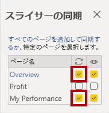

6. 「**概要**」 ページで、「**地域**」 スライサーを選択します。   

7. 「**概要** ページと 「**利益**」 ページをスライサーと同期します。   

	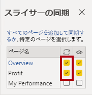

8. 異なるフィルター オプションを選択し、同期されたスライサーが同じオプションでフィルターすることを確認して、同期スライサーをテストします。

9. 「**スライサーの同期**」 ページを閉じるには、ウィンドウの右上にある 「**X**」 をクリックします。

	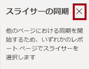

# 演習 2: ドリル スルーの構成

この演習では、新しいページを作成し、ドリル スルー ページとして構成します。設計が完了すると、ページは次のようになります。  

### タスク 1: ドリル スルー ページを作成する

このタスクでは、新しいページを作成し、ドリル スルー ページとして構成します。

1. 「**製品の詳細**」 という名前の新しいレポート ページを追加します。

	

2. 「**製品の詳細**」 ページ タブを右クリックし、「**ページの非表示**」 を選択します。

	

	*レポート ユーザーは、ドリル スルー ページに直接移動できません。他のページのビジュアルからアクセスする必要があります。このラボの最後の演習で、ページをドリル スルーする方法を学習します*。

3. 「**視覚化**」 ウィンドウの下の 「**ドリル スルー**」 セクションで、「**製品**」 を追加します。 ** | ** 「**ドリル スルー フィールドの追加**」 ボックスに 「**カテゴリ**」 フィールドを追加します。

	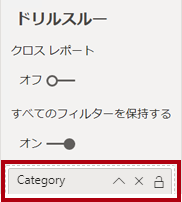

4. ドリル スルー ページをテストするには、ドリル スルー フィルター カードで 「**Bikes**」 を選択します。 

	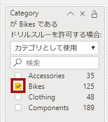

5. レポート ページの左上にある矢印ボタンに注目してください。

	

	*ボタンが自動的に追加されました。これにより、レポート ユーザーは、ドリル スルーしたあと、ページに戻ることができます*。

6. ページに **カード** ビジュアルを追加し、サイズを変更して、ボタンの右側に配置し、ページの残りの幅を埋めるようにします。 

	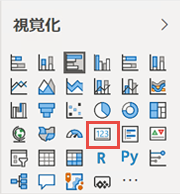

	

7. 「**製品 | カテゴリ**」 をカード ビジュアルにドラッグします。

8. ビジュアルの書式オプションを構成し、「**カテゴリ ラベル**」 プロパティを 「**オフ**」 にします。

	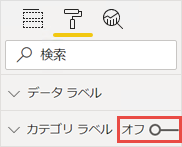

9. 「**背景色**」 プロパティを薄いグレーに設定します。

10. ページに **テーブル** ビジュアルを追加し、サイズを変更して、カード ビジュアルの下に配置し、ページ上の残りの領域を埋めます。

	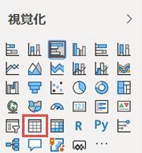

	

11. ビジュアルに次のフィールドを追加します。

	* 製品 | サブカテゴリ

	* 製品 | 色

	* 売上 | 数量

	* 売上 | 売上

	* 売上 | 利益率

12. ビジュアルの書式オプションを構成し、「**グリッド**」 セクションで、「**テキスト サイズ**」 プロパティを **20pt** に設定します。

	*ドリル スルー ページの設計はほぼ完了です。次の演習では、条件付き書式を定義します*。

# 演習 3: 条件付き書式の追加

この演習では、条件付き書式を使用してドリル スルー ページを拡張します。設計が完了すると、ページは次のようになります。  

### タスク 1: 条件付き書式を追加する

このタスクでは、条件付き書式を使用してドリル スルー ページを拡張します。

1. テーブル ビジュアルを選択します。

2. 「ビジュアル フィールド」 ウィンドウの 「**利益幅**」 フィールドで、下向き矢印をクリックし、「**条件付き書式**」 を選択します。 ** | アイコン**」 を選択します。

	

3. 「**アイコン - 利益幅**」 ウィンドウの 「**アイコン レイアウト**」 ドロップダウン リストで、「**データの右**」 を選択します。

	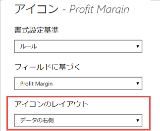

4. 中央のルールを削除するには、黄色い三角形の左側にある 「**X**」 をクリックします。 

	

5. 最初のルール (赤いひし形) を次のように設定します。

	* 2 番目のコントロールで、値を削除します

	* 3 番目のコントロールで、「**数値**」 を選択します

	* 5 番目のコントロールに **0** と入力します 

	* 6 番目のコントロールで、「**数値**」 を選択します

6. 2 番目のルール (緑の円) を次のように構成します。

	* 2 番目のコントロールに **0** と入力します

	* 3 番目のコントロールで、「**数値**」 を選択します

	* 5 番目のコントロールで、値を削除します

	* 6 番目のコントロールで、「**数値**」 を選択します

	

	*ルールは次のとおりです: 利益幅の値が 0 未満の場合は赤いひし形を表示します。もしくは、値が 0 より大きいか、等しい場合は、緑の円を表示します*。

7. 「**OK**」 をクリックします。

	

8. テーブル ビジュアルで、正しいアイコンが表示されていることを確認します。

	

9. 「**色**」 フィールドの背景色の条件付き書式を構成します。 

10. 「**背景色 - 色**」 ウィンドウの 「**形式**」 ドロップダウン リストで、「**フィールド値**」 を選択します。

	

11. 「**フィールドに基づく**」 ドロップダウン リストで、「**製品**」 を選択します **| 書式設定 | 背景色の形式**。

	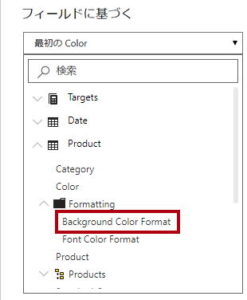

12. 「**OK**」 をクリックします。

	

13. 上記の手順を繰り返して、 次を使用して 「**色**」 フィールドのフォント色の条件付き書式を設定します。「**製品 | 書式設定 | フォント色の書式** フィールド

	*背景色とフォント色は、**Lab 02A** の **ColorFormats.csv** ファイルがソースであり、**Lab 03A** の**製品** クエリと統合されました*。

# 演習 4: ブックマークとボタンを追加する

この演習では、「**パフォーマンス**」 ページをボタンで拡張し、レポート ユーザーが表示する視覚化タイプを選択できるようにします。設計が完了すると、ページは次のようになります。  

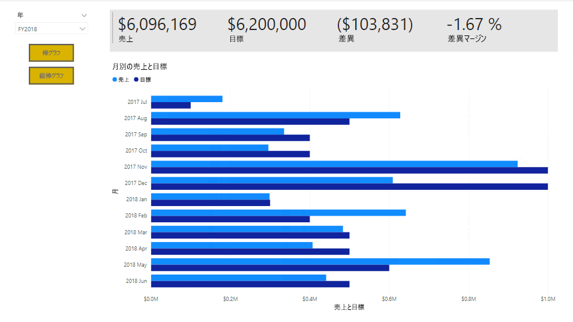

### タスク 1: ブックマークを追加する

このタスクでは、月ごとの販売/目標ビジュアルを表示する 2 つのブックマークを追加します。

1. 「**パフォーマンス**」 ページに移動します。

2. 「**表示**」 リボン タブの 「**ペインの表示**」 グループ内で、「**ブックマーク**」 をクリックします。

	

3. 「**表示**」 リボン タブの 「**ペインの表示**」 グループ内で、「**選択**」 をクリックします。

	

4. 「**選択**」 ウィンドウの 「**月間売上と目標**」 項目の横にあるビジュアルを非表示にするには、目のアイコンをクリックします。

	

5. 「**ブックマーク**」 ウィンドウで、「**追加**」 をクリックします。

	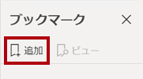

6. ブックマークの名前を変更するには、ブックマークをダブルクリックします。

7. 表示されているグラフが横棒グラフの場合は、ブックマークの名前を**横棒グラフ ON** に、それ以外はブックマークの名前を**縦棒グラフ ON** に変更します。

8. 「**選択**」 ウィンドウで、2 つの「**月別売上と目標**」 アイテムの表示を切り替えます。

	*つまり、表示されているビジュアルを非表示にして、非表示のビジュアルを表示させます*。

	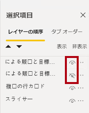

9. 2 番目のブックマークを作成し、適切な名前を付けます (**縦棒グラフ ON** または **横棒グラフ ON)。**

	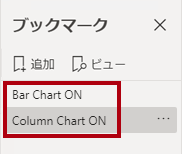

10. 「**選択**」 ウィンドウで、両方のビジュアルを表示するには、非表示のビジュアルをシンプルに表示します。 

11. 両方のビジュアルのサイズを変更して再配置し、マルチカード ビジュアルの下のページ全体に表示され、互いに完全に重なるようにします。

	*ヒント: 隠れたビジュアルを選択するには、「**選択**」 ウィンドウで選択します*。

	

12. **ブックマーク** ウィンドウで、各ブックマークを選択し、ビジュアルの 1 つだけが表示されていることを確認します。

	*設計の次の段階では、ページに 2 つのボタンを追加して、レポート ユーザーがブックマークを選択できるようにします*。

### タスク 2: ボタンの追加

このタスクでは、2 つのボタンを追加し、それぞれにブックマーク アクションを割り当てます。

1. 「**挿入**」 リボンの 「**要素**」 グループから、「**ボタン**」 をクリックしてから、「**空白**」 を選択します。

	

2. 「**年**」 スライサーの真下にボタンを再配置します。

3. ボタンを選択し、「**視覚化**」 ウィンドウで「**ボタン テキスト**」 プロパティを 「**オン**」 にします。

	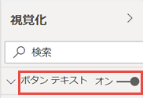

4. 「**ボタン テキスト**」 セクションを展開し、「**ボタン テキスト**」 ボックスに「**横棒グラフ**」と入力します。

5. 適切な色を使用して背景色を書式設定します。

6. 「**アクション**」 プロパティを 「**オン**」 にします (リストの下部近くにあります)。

	

7. 「**アクション**」 セクションを展開し、「**種類**」 ドロップダウンリストを 「**ブックマーク**」 に設定します。

8. 「**ブックマーク**」 ドロップダウン リストで、「**横棒グラフ ON**」 を選択します。

	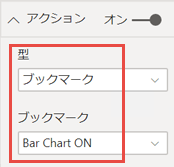

9. コピーと貼り付けを使用してボタンのコピーを作成し、次のように新しいボタンを構成します。

	* 「**ボタン テキスト**」 プロパティを 「**縦棒グラフ**」 に設定する

	* 「**アクション**」 セクションで、「**ブックマーク**」 ドロップダウン リストを 「**縦棒グラフ ON**」 に設定します

### タスク 3: レポートの公開

このタスクではレポートを発行します。

1. 「**概要**」 ページを選択します。

2. 「**年**」 スライサーで、「**2020 年度**」 を選択します。

3. 「**リージョン**」 スライサーで、「**すべて選択**」 を選択します。

4. Power BI Desktop ファイルを保存します。

5. レポートを **「販売分析」** ワークスペースに公開します。

6. レポートを置き換えるメッセージが表示されたら、「**置換**」 をクリックします。 

	

7. Power BI Desktop を開いたままにしておきます。

	*次の演習では、Power BI サービスでレポートを調べます*。

# 演習 5: レポートを見る

この演習では、Power BI サービスの**販売レポート**を確認します。

### タスク 1: レポートの調査

このタスクでは、Power BI サービスの**売上レポート**を調べます。

1. Microsoft Edge の Power BI サービスで、「**売上レポート**」 レポートを開きます。

2. ドリル スルー レポートをテストするには、「**カテゴリ別数量**」 ビジュアルで 「**服飾**」 バーを右クリックし、「**ドリルスルー**」 を選択します。 ** | 商品の詳細**。

	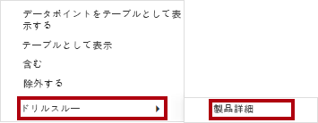

3. 「**商品の詳細**」 ページは **服飾用** であることを確認します。

4. ソース ページに戻るには、左上隅の矢印ボタンをクリックします。

5. **「マイ パフォーマンス」** ページを選択します。

6. 各ボタンをクリックすると、別のビジュアルが表示されます。

### 仕上げ

このタスクでは、ラボを完了します。

1. ワークスペースに戻るには、階層リンクの軌跡でワークスペース名をクリックします。

	

2. 「エッジ」 のブラウザー画面は開いたままにします。

3. Power BI Desktop で、「**自分の実績**」 ページに移動し、「**フィールド**」 ウィンドウで「**営業担当**」 フィルター カードを削除します。

	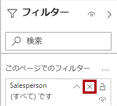

4. 「**概要**」 ページを選択します。

5. Power BI Desktop ファイルを保存し、**売上分析**ワークスペースに再発行します。

6. Power BI Desktop を閉じます。

	***ラボ 12A** でレポートを共有すると、レポートは行レベルのセキュリティを施行します*。
