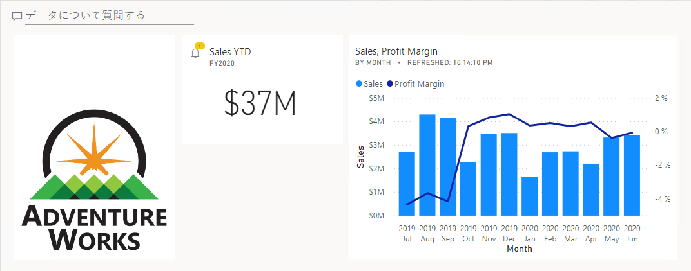
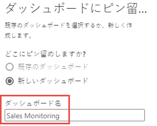
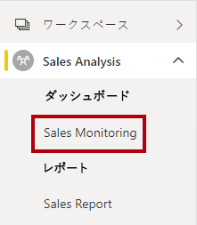
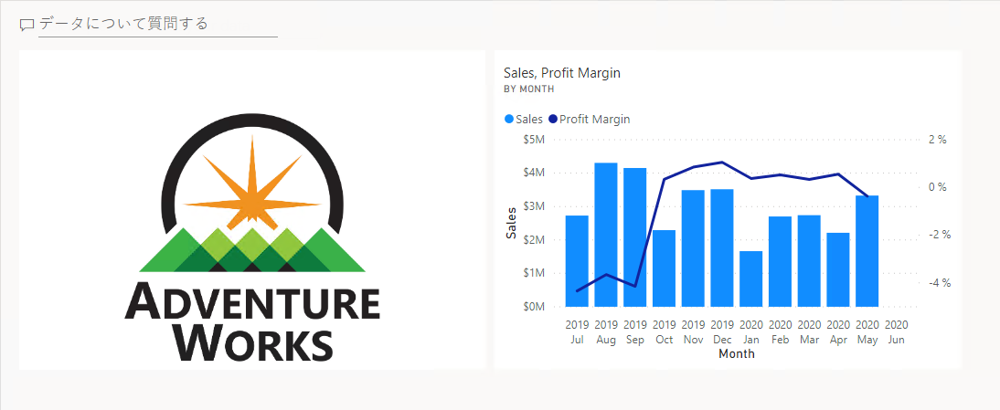
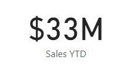
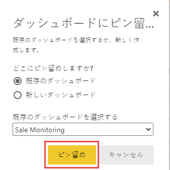
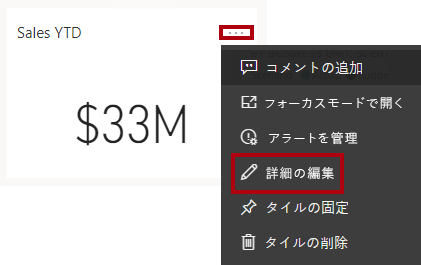
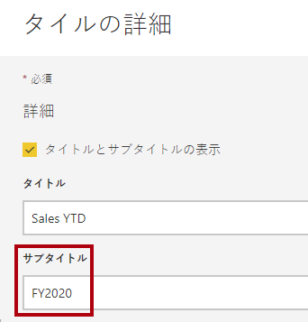
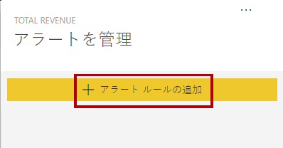
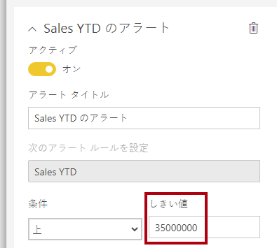



### ラボ 10A

Power BI ダッシュボードの作成

# 概要

**ラボを完了するための所要時間は 45 分です**

このラボでは、**営業モニタリング**ダッシュボードを作成します。 

このラボでは、次の方法を学習します。

* ダッシュボードにビジュアルをピン留めする

* Q&A を使用してダッシュボード タイルを作成する

* ダッシュボード タイル アラートを構成する

# 演習 1: ダッシュボードの作成

この演習では、**営業モニタリング**ダッシュボードを作成します。  完成したダッシュボードは次のようになります。  

### タスク 1: ダッシュボードを作成する

このタスクでは、**営業モニタリング**ダッシュボードを作成します。

1. Microsoft Edge の Power BI サービスで、「**Sales Report**」 レポートを開きます。

2. ダッシュボードを作成してロゴ画像をピン留めするには、Adventure Works のロゴの上にカーソルを置きます。

3. 右上隅にあるプッシュピンをクリックします。

	

4. 「**ダッシュボードにピン留め**」 ウィンドウの 「**ダッシュボード名**」 ボックスに、「**営業モニタリング**」と入力します。     

	

5. 「**ピン留め**」 をクリックします。 

	

6. **Year**スライサーを **FY2020** に設定します。 

	

7. 「**Region**」 スライサーを 「**すべて選択**」 に設定します。   

	*ビジュアルをダッシュボードにピン留めする場合、現在のフィルター コンテキストが使用されます。一度ピン留めすると、フィルター コンテキストを変更することはできません。時間ベースのフィルターの場合は、相対日付スライサー (または、相対時間ベースの質問を使用して Q&A) を使用することをお勧めします*。

8. **MonthによるSalesおよびProfit Margin** (折れ線と棒グラフ) ビジュアルを 「**営業モニタリング**」 ダッシュボードにピン留めします。

9. 「**ナビゲーション**」 ウィンドウを開き、 **営業モニタリング**ダッシュ ボードを開きます。 

	

10. ダッシュボードには 2 つのタイルがあることに注意してください。

	

11. ロゴ タイルのサイズを変更するには、右下隅をドラッグし、タイルのサイズを 1 単位幅、高さ 2 単位に変更します。

	*タイル サイズは、長方形の図形に制限されます。長方形の倍数にサイズ変更することしかできません*。

12. 質問に基づいてタイルを追加するには、ダッシュボードの左上にある 「**データに関する質問をする**」 をクリックします。 

	

13. Q&A 機能を使用して質問をすると、Power BI はビジュアルに返信します。

14. 灰色のボックスの Q&A ボックスの下にある、おすすめの質問のいずれかをクリックします。

15. 応答を確認します。

16. Q&A  ボックスからすべてのテキストを削除します。

17. Q&A ボックスに、次のように入力します。**現時点年間累計販売**

	

18. **(空白)** の応答に注意してください。 

	

	***ラボ 06B** で **Sales YTD** メジャーを追加したことを思い出してください。    このメジャーはタイム インテリジェンス式であり、 結果を生成するには **Date** テーブルにフィルターが必要です。*

19. **2020 年度**に質問を拡張してください。

	

20. 応答が**3,300 万ドル**になったことに注意してください。

	

21. 応答をダッシュボードにピン留めするには、右上隅の 「**ビジュアルをピン留めする**」 をクリックします。 

	

22. タイルをダッシュボードにピン留めするかどうかを確認するメッセージが表示されたら、「**ピン留め**」 をクリックします。 

	

	*新しいダッシュボードにピン留めするだけのバグが考えられます。Power BI セッションが 「マイ ワークスペース」 に戻ったためです。この場合は、新しいダッシュボードにピン留めしないでください。 **Sales Analysis**ワークスペースに戻り 、ダッシュボードを再度開いて、Q&A 質問を再作成します*。

23. ダッシュボードに戻るには、左上隅にある 「**Q&amp;A を終了する**」 をクリックします。

	

### タスク 2: タイルの詳細を編集する

このタスクでは、2 つのタイルの詳細を編集します。

1. カーソルを 「**Sales YTD**」 タイルの上に置いてから、タイルの右上にある省略記号をクリックして、「**詳細の編集**」 を選択します。   

	

2. 「**タイルの詳細**」 ウィンドウ (右側) の 「**サブタイトル**」 ボックスに「**FY2020**」と入力します。     

	

3. ペインの下部で、「**適用**」 をクリックします。

	

4. **売上 YTD** タイルにサブタイトルが表示されることに注意してください。

	

5. **売上、利益率**タイルの、タイルの詳細を編集します。 

6. 「**タイルの詳細**」 ウィンドウの 「**機能**」 セクションで、「**前回の更新時刻を表示する**」 をオンにします。

	

7. 「**適用**」 をクリックします。

	

8. タイルは、最後の更新時間 (Power BI Desktop でデータ モデルを更新するときに行った) を示しています。

このラボの後半で、データ更新をシミュレートし、更新時刻が更新されることを確認します。

### タスク 3: アラートを構成する

このタスクでは、データ アラートを構成します。

1. 「**売上YTD**」 タイルにカーソルを合わせ 、省略記号をクリックして、「**アラートの管理**」 を選択します。

	

2. 「**アラートの管理**」 ウィンドウ (右側) で、「**アラート ルールの追加**」 をクリックします。   

	

3. 「**しきい値**」 ボックスで、値を **35000000** (3,500 万) に置き換えます。 

	

	*この構成により、タイルが 3,500 万を超える値に更新されるたびに通知が送信されます*。

4. ウィンドウの下部にある 「**保存して閉じる**」 をクリックします。

	

	*次の演習では、データセットを更新します。通常、この処理はスケジュールされた更新を使用して行う必要があり、Power BI はゲートウェイを使用して SQL サーバー データベースに接続できます。ただし、教室での構成には制約があるため、ゲートウェイはありません。Power BI Desktop を開き、手動でデータ更新を実行し、ファイルをアップロードします*。

# 演習 2: データセットの更新

この演習では、最初に 2020 年 6 月の受注データを **AdventureWorksDW2020** データベースに読み込み、次に教室のパートナーのアカウントをデータベースに追加します。  次に、Power BI Desktop ファイルを開き、データ更新を実行し、そのファイルを 「**Sales Analysis**」 ワークスペースにアップロードします。 

### タスク 1: ラボ データベースを更新する

このタスクでは、PowerShell スクリプトを実行して、**AdventureWorksDW2020** データベースのデータを更新します。

1. 「ファイル エクスプローラー」 の **D:\DA100\Setup** フォルダー内で、**UpdateDatabase-2-AddSales.ps1** ファイルを右クリックし、「**PowerShell で実行**」 を選択します。     

	

	37.キーを押して続行するように求められたら、**Enter** をもう一度押します。 

	***AdventureWorksDW2020** データベースには、2020 年 6 月の販売注文が含まれています*。  

2. **D:\DA100\Setup** フォルダー内で、 **UpdateDatabase-3-AddPartnerAccount.ps1** ファイルを右クリックし、「**PowerShell で実行**」 を選択します。

3. ダイアログ ボックスが表示されたら、教室のパートナーのアカウント名を入力し、**Enter** キーを押します。 

	*アカウント名 (@ の記号の前のすべての文字) を入力するだけです。近くに座っている人を探してペアを組んでください。いっしょに作業して、Power BI コンテンツの共有をカバーする**ラボ 12A** を完了します。*

	*行レベルのセキュリティをテストできるように、アカウント名が追加されます。あなたのパートナーはパメラ アンサム ウルフで、彼女の販売のパフォーマンスは 2 つの販売地域での売り上げで測定されます。米国北西部および米国南西部*.

### タスク 2: Power BI Desktop ファイルを更新する

このタスクでは、営業分析 Power BI Desktop ファイルを開き、データの更新を実行し、そのファイルを **Sales Analysis**ワークスペースにアップロードします。

1. **D:\DA100\MySolution** フォルダーに保存されている **営業分析** Power BI Desktop ファイルを開きます。

	***ラボ 06B** でファイルを発行した時、ラボを正常に完了した自信がない場合は、代わりにソリューション ファイルをアップロードするよう勧められました。ソリューション ファイルをアップロードした場合は、ここでソリューション ファイルをもう一度開いてください。ファイルは **D:\DA100\Lab06B\Solution** フォルダーにあります*。

2. 「**ホーム**」 リボンの 「**クエリ**」 グループから、「**更新**」 をクリックします。

	

3. 更新が完了したら、Power BI Desktop ファイルを保存します。

4. ファイルを 「**Sales Analysis**」 ワークスペースに発行します。

5. データセットを置き換えるメッセージが表示されたら、「**置換**」 をクリックします。 

	

	*Power BI サービスのデータセットには、2020 年 6 月の売上データが含まれるようになりました*。

6. Power BI Desktop を閉じます。

7. Microsoft Edge の Power BI サービスの 「**Sales Analysis**」 ワークスペースで、**Sales Report**レポートも公開されていることがわかります。

	このレポートは、**ラボ 05A** および **ラボ 06A** で開発したモデルをテストするために使用したものです。

8. **Sales Analysis**レポート (データセットではありません) を削除します。

# 演習 3: ダッシュボードの確認

この演習では、ダッシュボードを確認して、更新された売上を確認し、アラートがトリガーされたことを確認します。

### タスク 1: ダッシュボードを確認する

このタスクでは、ダッシュボードを確認して、更新された売上を確認し、アラートがトリガーされたことを確認します。

1. Microsoft Edge の Power BI サービスで、「**営業モニタリング**」 ダッシュボードを開きます。

2. 「**Sales, Profit Margin**」 タイルのサブタイトルで、データの更新日時が  「**ReFRESHED NOW**」 になっている事を確認します。

3. また 「**2020 年 6 月**」 の列が表示されていることにも注意してください。

	

	*「**Sales YTD**」 タイルのアラートもトリガーされているはずです。しばらくすると、設定したしきい値を売上が超えたことをアラートで通知されます*。

4. **Sales YTD** タイルが **$37M** に更新されたことを確認します。

5. 「**Sales YTD**」 タイルにアラート通知アイコンが表示されていることを確認します。

	*通知が表示されない場合は、**F5** キーを押してブラウザーをリロードしてください。それでも通知が表示されない場合は、しばらく待ちます*。

	

	*アラート通知はダッシュボード タイルに表示され、電子メールで配信したり、Apple Watch8 などのモバイル アプリにプッシュ通知を送信したりできます。*
