

### ラボ 11A

Power BI Desktop でのデータ分析

# 概要

**ラボを完了するための所要時間は 45 分です**

このラボでは**販売調査**レポートを作成します。

このラボでは、次の方法を学習します。

* アニメーション散布図を作成する

* ビジュアルを使用して値を予測する

* 分解ツリーのビジュアルを操作する

* 主要な影響のビジュアルを操作する

# 演習 1: レポートの作成

この演習では、**販売調査**レポートを作成します。

### タスク 1: レポートの作成

このタスクでは、**販売調査**レポートを作成します。

1. Power BI Desktop を開き、ようこそ画面を閉じます。

	

2. **D:\DA100\MySolution** フォルダーに、**販売調査**としてファイルを保存します。

	

3. **販売分析**データセットへのライブ接続を作成します。

	*ヒント: 「**ホーム**」 リボン タブの 「**データの取得**」 コマンドを使用し、「**Power BI データセット**」 を選択します*。

	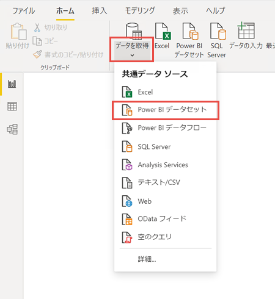

	*4 つのレポート ページを作成し、各ページで異なるビジュアルを使用してデータを分析および調査します*。

# 演習 2: 散布図の作成

この演習では、アニメーション化できる散布図を作成します。

### タスク 1: アニメーション散布図を作成する

このタスクでは、アニメーション化できる散布図を作成します。

1. **ページ 1** の名前を **Scatter Cha****rt** として変更します。

	

5. レポート ページに **散布図**ビジュアルを追加してから、ページ全体に表示されるように再配置およびサイズ変更します。

	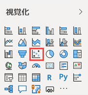

	

6. ビジュアル ウェルズに次のフィールドを追加します。

	* 凡例: **リセラー | ビジネス タイプ**

	* X 軸: **売上 | 売上** 

	* Y 軸: **売上 | 利益率**

	* サイズ: **売上 | 数量**

	* 再生軸: **日付 | 四半期**

	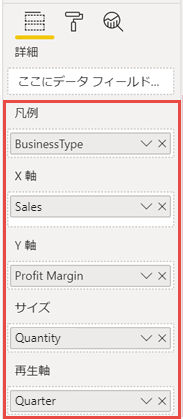

	*グラフは、フィールドが**再生軸** ウェルに追加されたときにアニメーション化できます*。

7. 「**フィルター**」 ペインで、「**製品**」 を追加します** | **「**カテゴリ**」 フィールドから 「**このページのフィルター**」 ウェル。

8. フィルター カードで、「**バイク**」 によってフィルター処理します。

	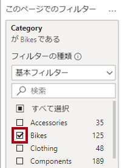

9. グラフをアニメーション化するには、左下の 「**再生**」 をクリックします。

	

10. **2018 年度第 1 四半期**から **2020 年度第 4 四半期**までのアニメーション サイクル全体を見てください。

	*散布図では、測定値を同時に理解できます。この場合、注文数量、売上高、および利益率です*。

	*各バブルは、リセラーのビジネス タイプを表します。バブルのサイズの変化は、注文数量の増加または減少を反映しています。水平方向の動きは売上高の増加/減少を表し、垂直方向の動きは収益性の増加/減少を表します*。

11. アニメーションが停止したら、バブルの 1 つをクリックして、時間の経過に従ってトラッキングを表示します。

12. カーソルを任意のバブルの上に置くと、その時点でのリセラー タイプのメジャー値を説明するヒントが表示されます。

13. 「**フィルター**」 ペインで、「**服**」 でフィルター処理するだけで、結果が非常に異なっていることがわかります。

14. Power BI Desktop ファイルを保存します。

# 演習 3: 予測の作成

この演習では、将来の売上見込み収益を決定する予測を作成します。

### タスク 1: 予測の作成

このタスクでは、将来の売上見込み収益を決定する予測を作成します。

1. 新しいページを追加し、ページの名前を「**予測**」に変更します。

	

16. レポート ページに**折れ線グラフ** ビジュアルを追加してから、ページ全体に表示されるように位置を変更してサイズを変更します。

	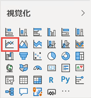

	

17. ビジュアル ウェルズに次のフィールドを追加します。

	* 軸: **日付 | 日付**

	* 値: **売上 | 売上** 

	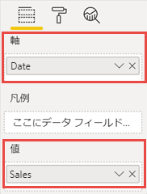

18. 「**フィルター**」 ペインで、「**日付**」** | **「**年**」 フィールドから 「**このページのフィルター**」 ウェル。

19. フィルター カードで、2 年でフィルター処理します。**2019 年度**および **2020 年度** に表示されます。

	

	*正確で安定した予測を生成するには、時系列で予測する場合、少なくとも 2 サイクル (年) のデータが必要になります*。

20. **商品**も追加します** | **「**カテゴリ**」 フィールドを 「**このページのフィルター**」 ウェル、そして **バイク**でフィルター処理します。

	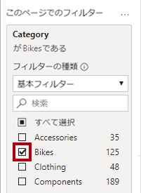

21. 予測を追加するには、「**視覚化**」 ウィンドウの下にある 「**分析**」 ウィンドウを選択します。

	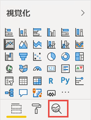

22. 「**予測**」 セクションを展開します。

	

	*「**予測**」 セクションが使用できない場合は、ビジュアルが正しく構成されていない可能性があります。予測は、2 つの条件が満たされている場合にのみ使用できます: 軸には date 型のフィールドが 1 つあり、値フィールドは 1 つだけです*。

23. 「**追加**」 をクリックします。

	

24. 次の予測プロパティを構成します。

	* 予測の長さ: 1 か月

	* 信頼区間: 80%

	* 季節性: 365

25. 「**適用**」 をクリックします。

	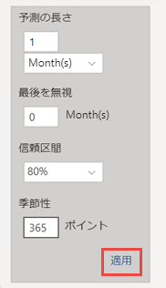

26. ライン ビジュアルでは、予測が履歴データより 1 か月延長されていることに注意してください。

	*灰色の領域は、信頼度を表します。信頼度が広いほど、安定性が低くなるため、予想はより精度が低くなります*。

	*サイクルの長さ (この場合は年次) がわかっている場合は、季節性ポイントを入力する必要があります。週単位 (7) または月次 (30) の場合もあります*。

27. 「**フィルター**」 ペインで、「**服**」 のみでフィルター処理すると、異なる結果が生成されます。

28. Power BI Desktop ファイルを保存します。

# 演習 4: 分解ツリーの操作

この演習では、分解ツリーを作成して、リセラーの地域と利益率の関係を調べます。

### タスク 1: 分解ツリーの操作

このタスクでは、分解ツリーを作成して、リセラーの地域と利益率の関係を調べます。

1. 新しいページを追加し、ページの名前を**分解ツリー**に変更します。

	

30. 「**挿入**」 リボンの 「**AI ビジュアル」** グループ内から、「**分解ツリー**」 をクリックします。

	*ヒント: AI ビジュアルは、**視覚化**ウィンドウでも使用できます*。

	

31. ページ全体に表示されるようにビジュアルの位置とサイズを変更します。

	

32. ビジュアル ウェルズに次のフィールドを追加します。

	* 分析: **売上 | 利益率**

	* 説明: **リセラー | 地理** (階層全体)

	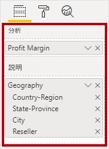

33. 「**フィルター**」 ペインで、「**日付**」** | **「**年**」 フィールドを 「**このページのフィルター**」 ウェルに設定し、フィルターを**2020 年度**に設定します。

	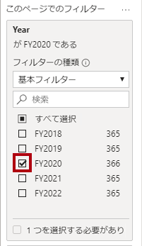

34. 分解ツリーのビジュアルで、ツリーのルートに注目してください。**利益率** -0.94% で

	

35. プラス アイコンをクリックし、コンテキスト メニューで 「**高い値**」 を選択します。 

	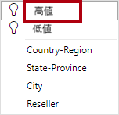

36. デシジョン ツリーには、利益率の高い順に並べられたリセラーが表示されていることに注意してください。

37. レベルを削除するには、ビジュアル上部の 「**リセラー**」 ラベルの横にある 「**X**」 をクリックします。

	

38. プラス アイコンをもう一度クリックし、**国と地域**のレベルに展開します。

39. **米国から**  **州 - 県**レベルに展開します。   

40. ビジュアルの下部にある**州**の下向き矢印を使用し、収益性の低い州までスクロールします。

41. **ニューヨーク**州の収益性がマイナスであることに注目してください。 

42. **ニューヨーク**から**リセラー** レベルに展開します。   

43. 根本原因を特定するのは簡単です。

	

	***米国**は **FY2020** に利益を生み出していません。**ニューヨーク**州はプラスの利益を達成していない州の 1 つであり、その理由は、4 つのリセラーが商品の標準コストよりも低い支払いをしているためです。*

44. Power BI Desktop ファイルを保存します。

# 演習 5: キー インフルエンサーの操作

この演習では、主要なインフルエンサー AI ビジュアルを使用して、リセラーのビジネス タイプと地域の収益性に何が影響するかを判断します。

### タスク 1: 主要なインフルエンサーとの連携

このタスクでは、主要なインフルエンサー AI ビジュアルを使用して、リセラーのビジネス タイプと地域の収益性に何が影響するかを判断します。

1. 新しいページを追加してから、そのページの名前を**キー インフルエンサー**に変更します。

	

46. 「**挿入** リボンの 「**AI ビジュアル**」 グループ内から、「**キー インフルエンサー**」 をクリックします。

	*ヒント: AI ビジュアルは、**視覚化**ウィンドウでも使用できます*。

	

47. ページ全体に表示されるようにビジュアルの位置とサイズを変更します。

	

48. ビジュアル ウェルズに次のフィールドを追加します。

	* 分析: **売上 | 利益率**

	* 説明: **リセラー | ビジネス タイプ**と**リセラー | 地理** (階層全体)

	* 展開方法: **売上 | 数量**

	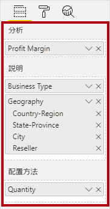

49. ビジュアルの左上に、 **キー インフルエンサー**がフォーカスされており、利益率を増加させるものが何かを理解するために特定の影響が設定されていることにに注目してください。

	

50. 結果を確認すると、**ボテル**の都市が増加する可能性が高いということが分かります。

51. 目標を変更して、利益率の低下に影響を与える影響を判断します。

	

52. 結果を確認します。

53. セグメントを検出するには、左上の 「**上位セグメント**」 を選択します。

	

54. ここでの目標は、利益率が高くなる可能性が高いときにセグメントを決定することです。

55. ビジュアルにセグメントが (円で) 表示されたら、セグメントの 1 つをクリックして、そのセグメントに関する情報を表示します。

56. セグメントの結果を確認します。

### 仕上げ

このタスクでは、ラボを完了します。

1. Power BI Desktop ファイルを保存します。

58. 「**散布図**」 ページを選択します。

59. ファイルを 「**販売分析**」 ワークスペースに発行します。

60. Power BI Desktop を閉じます。
