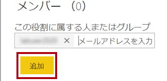
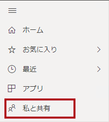
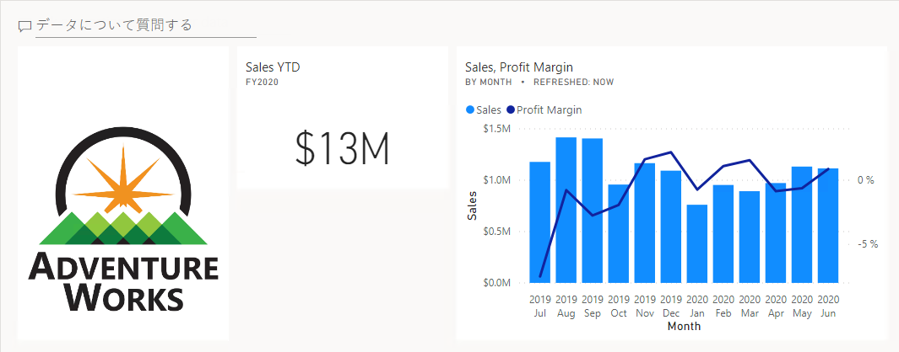
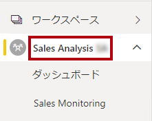
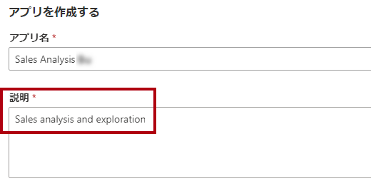
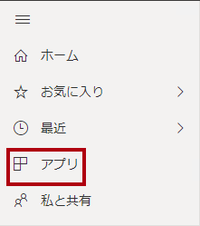
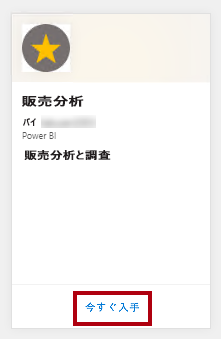
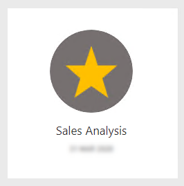
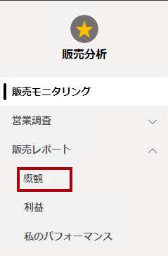
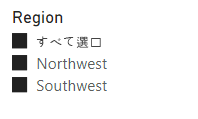



### ラボ 12A

Power BI コンテンツの公開と共有

# 概要

**ラボを完了するための所要時間は 45 分です**

このラボでは、受講クラスのパートナーとペアで作業し、Power BI コンテンツを共有するための 3 つの主要な方法を実習します。

このラボでは、次の方法を学習します。

* セキュリティ プリンシパルをデータセット ロールにマップする

* ダッシュボードの共有

* アプリを発行します

# 演習 1: データセット セキュリティを構成する

この演習では、受講クラスのパートナーのアカウントをデータセットの**営業担当者**ロールに割り当てます。

### タスク 1: データセットのセキュリティを構成する

このタスクでは、受講クラスのパートナーのアカウントをデータセットの**営業担当者**ロールに割り当てます。

1. Microsoft Edge の Power BI サービスで、「**ナビゲーション**」 ウィンドウの 「**営業分析**」 データセットにカーソルを合わせ、垂直の省略記号 (..) をクリックして、「**セキュリティ**」 を選択 します。

	

2. 「**行レベルのセキュリティ**」 ページの左側で、「**営業担当者**」 ロールが選択されていることを確認します。

3. 「**メンバー**」 ボックスで、受講クラスのパートナーのアカウント名を入力し、候補がリスト表示されたら選択します。

	*個々のアカウントを追加するには時間がかかり、多くのメンテナンスが必要です。Adventure Works 社には、すべての営業担当者アカウントを含むセキュリティ グループがある可能性が高いと考えてください。このセキュリティ グループは、 ロールにマップされる唯一のセキュリティ プリンシパルになります*。

4. 「**追加**」 をクリックします。

	

5. ページの下部にある 「**保存**」 をクリックします。

	

	*クラスルーム パートナーのアカウントが**営業担当者**の役割にマッピングされました。彼らのアカウントは、販売員 Pamela Ansam-Wolfe のためのもので、販売実績は 2 つの販売地域の販売によって測定されます。米国北西部および米国南西部*.

# 演習 2: ダッシュボードの共有

この演習では、 **売上の監視**ダッシュボードを受講クラスのパートナーに共有します (そして、パートナーから共有されます)。

### タスク 1: ダッシュボードの共有

このタスクでは、各ダッシュボードを共有し、共有された共有ダッシュボードを開きます。

*受講クラスのパートナーと共に、各コンピュータで、すべてのタスク手順を一緒に実行します*。

1. **売上の監視**ダッシュボードを開きます。

7. メニューバーで、「**共有**」 をクリックします。

	

8. 「**ダッシュボードの共有**」 ウィンドウ (右側) の 「**アクセスの許可**」 ボックスで、受講クラスのパートナーのアカウント名を入力し、候補がリスト表示されたら選択します 。

9. 使用可能なオプションを確認しますが、変更しないでください。

10. 画面の最下部で、「**共有**」 をクリックします。

	

### タスク 2: 共有ダッシュボードを開く

このタスクでは、共有されているダッシュボードをそれぞれ開きます。

1. 「**ナビゲーション**」 ウィンドウで、「**共有アイテム**」 をクリックします。

	

12. 「**売上の監視**」 ダッシュボードが表示されていることを確認します。

	

13. ダッシュボードを開くには、「**売上の監視**」 ダッシュボードをクリックします。

14. ダッシュボードの 「**売上累計**」 タイルの値は **$13M** であることを確認してください。

	

	*「**売上累計**」 タイルには、米国北西部および米国南西部の地域に対する値のみが表示されます*。

	*ダッシュボード (およびレポート) の共有は、コンテンツ所有者が簡単に実行および管理できます。Power BI は、受信者に読み取り専用のエクスペリエンスを提供します。所有者が再共有を有効にすると、共有ユーザーはコンテンツをさらに他のユーザーと共有できます*。

	*この方法は、アドホック共有の要件に確保する必要があります。Power BI アイテムを多数共有する必要がある場合は、アプリを公開する方が適切なオプションです。次の演習では、営業分析ワークスペースをアプリとして公開します*。

# 演習 3: アプリを公開する

この演習では、**営業分析**ワークスペースのコンテンツを公開し、受講クラスのパートナーが公開したアプリを「取得」します。

### タスク 1: アプリを発行します

このタスクでは、**営業分析**ワークスペースのコンテンツを公開し、受講クラスのパートナーが公開したアプリを「取得」します。

1. 「**ナビゲーション**」 ウィンドウで、「**営業分析**」 ワークスペースを開きます。

16. **ナビゲーション** ウィンドウで、ワークスペースの名前をクリックします。 

	

17. 右上の 「**アプリの公開**」 をクリックします。

	

18. アプリの公開プロセスでは、次の 3 つのタブで構成する必要があることに注意してください。**構成**、 **ナビゲーション**、および **アクセス許可**。    

	

19. 「**説明**」 ボックスに、次のように入力します。  **販売分析と調査**

	

20. 「**アプリのロゴ**」 で 「**アップロード**」 をクリックします。

	画像 91](Linked_image_Files/PowerBI_Lab12A_image13.png)

21. 「**開く**」 ウィンドウで、「**D:\DA100\Lab12A\Assets\Icons**」 フォルダーに移動します。   

22. JPG ファイルのいずれかを選択し、「**開く**」 をクリック します。 

23. 「**アプリのテーマ色**」 で任意の色を選択します。

24. 「**ナビゲーション**」 タブを選択します。

	

25. 「**ナビゲーション**」 セクションで、公開されるワークスペース コンテンツを確認します。

	*ワークスペース コンテンツの順序を設定したり、セクションやリンクを追加したりできます。セクションは、単一レベルのコンテンツのグループです (フォルダーと同様)。リンクは、有効な Web ページへのリンクです。このラボでは、ナビゲーション設定は変更しません*。

26. 「**アクセス許可**」 タブを選択します。

	

27. 「**特定の個人またはグループ**」 ボックスで、受講クラスのパートナーのアカウント名を入力し、候補がリスト表示されたら選択します。

	*テナント管理者が制限している場合は、「**組織全体**」 オプションが無効になります。この場合、「**このアプリを自動的にインストールする**」 オプションも無効になります。有効にすると、アプリがすべてのユーザーにプッシュされる可能性があります。次のタスクでアプリを「取得」する方法を学びます*。

28. 右下隅の 「**アプリの発行**」 をクリックします。

	

29. アプリの公開を求めるメッセージが表示されたら、「**公開**」 をクリックします。

	

30. アプリが正常に公開されたことを通知されたら、「**閉じる**」 をクリック します。 

	

### タスク 2: アプリを入手する

このタスクでは、アプリを「取得」し、アプリのコンテンツを確認します。

1. **ナビゲーション** ウィンドウで、**アプリ**をクリックします。

	

32. ページの中央にある 「**アプリの取得**」 をクリックします。 

	

33. 「AppSource」 ウィンドウで、受講クラスのパートナーが公開した**営業分析**アプリの 「**今すぐ取得**」 リンクをクリックします。

	

34. アプリが追加されたら、アプリを開き、アプリのタイルをクリックします。

	

35. アプリが開いたら、ナビゲーション ウィンドウ (左側) を確認します。

36. ナビゲーション ウィンドウの最初の項目が開いていることに留意してください。

37. 「ナビゲーション」 ウィンドウで、「**売上レポート**」 を展開し、「**概要**」 ページを選択します。

 	

38. 「**リージョン**」 スライサーには、Pamela Ansam-Wolfe に割り当てられたリージョンが 2 つしか表示されないことを確認します。

	

39. **「マイ パフォーマンス」** ページを選択します。

40. ページには、Pamela Ansam-Wolfe の売上と目標が表示されています。

41. 「**営業調査**」 レポートを開き、各ページのビジュアルと対話します。
